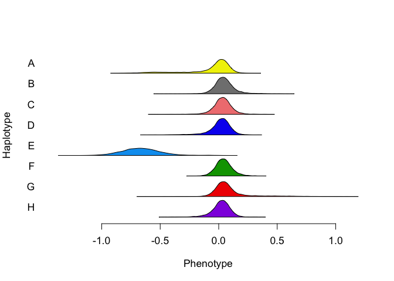

Neto hotspot 4 analysis per Rick’s email
================
Frederick J. Boehm
11/18/2019

Last modified: 2019-11-18 14:21:56.

## Text of Rick’s email on Nov 18, 2019

> Sorry for the misunderstanding. I’m only interested in the hotspot4
> traits identified in the analysis I sent on Friday afternoon
> (hotspots\_allele\_effects2.html). There are 11 traits. The
> trait/probe information was in my Email message, but I add it here
> again. /rb

> ## 4:Chr10.34
> 
> ## RVBD\_0158 : JAX00302006
> 
> ## RVBD\_0437c : JAX00301562
> 
> ## RVBD\_0490 : UNC18950608
> 
> ## RVBD\_1051c : UNC18908602
> 
> ## RVBD\_1493 : UNC18891985
> 
> ## RVBD\_1692 : UNC18962410
> 
> ## RVBD\_2643A : UNC18925693
> 
> ## RVBD\_2854 : JAX00300565
> 
> ## RVBD\_3261 : UNCHS029542
> 
> ## RVBD\_3262 : UNCHS029517
> 
> ## RVBD\_3452 : JAX00302076

## Analysis

``` r
library(dplyr)
```

    ## 
    ## Attaching package: 'dplyr'

    ## The following objects are masked from 'package:stats':
    ## 
    ##     filter, lag

    ## The following objects are masked from 'package:base':
    ## 
    ##     intersect, setdiff, setequal, union

``` r
library(TIMBR)
```

``` r
probs <- readRDS("../data/genotypes_array.rds")
traits <- readRDS("../data/tnseq-traits.rds")
```

``` r
tt <- read.csv("../data/neto_traits_by_probe3_annotated.csv")
neto <- tt %>%
  tidyr::pivot_longer(cols = V2:V35, values_to = "trait", names_to = "trait_name") %>%
  dplyr::filter(!is.na(trait)) %>%
  dplyr::select(- trait_name, - neto.n, - row, - n.traits, - cM, -hs, - chr)
neto_plus <- tt %>%
  tidyr::pivot_longer(cols = V2:V35, values_to = "trait", names_to = "trait_name") %>%
  dplyr::filter(!is.na(trait)) %>%
  dplyr::select(- trait_name)

traits_timbr_annotated <- neto_plus %>%
  dplyr::select(probe, trait) %>%
  purrr::pmap( 
           .f = function(probe, trait){
             pheno <- traits[ , colnames(traits) == trait, drop = FALSE]
             geno <- probs[ , , dimnames(probs)[[3]] == probe]
             qtl2::fit1(genoprobs = geno, 
                        pheno = pheno, 
                        )
           }
             ) %>%
  purrr::map(.f = function(x){
    tibble::tibble(lod = x$lod)
  }) %>%
  bind_rows() %>%
  bind_cols(neto_plus) %>%
  dplyr::select(probe, trait, lod, hs) %>%
  dplyr::group_by(hs) %>%
  dplyr::group_by(trait) %>%
  dplyr::filter(lod == max(lod)) %>%
  dplyr::ungroup() %>%
  dplyr::ungroup()
```

``` r
(hot_indices <- neto_plus %>%
  dplyr::group_by(hs) %>%
  dplyr::tally() %>%
  dplyr::mutate(end = cumsum(n)) %>%
  dplyr::mutate(start = 1L + end - n)
)
```

    ## # A tibble: 10 x 4
    ##       hs     n   end start
    ##    <int> <int> <int> <int>
    ##  1     1     9     9     1
    ##  2     2    15    24    10
    ##  3     3    15    39    25
    ##  4     4  1905  1944    40
    ##  5     5    20  1964  1945
    ##  6     6  1265  3229  1965
    ##  7     7     8  3237  3230
    ##  8     8    80  3317  3238
    ##  9     9    66  3383  3318
    ## 10    10     2  3385  3384

### TIMBR setup

``` r
##### From GK example code
# Specify allelic series prior
# Suggested by Wes
# Influences how much prior weight it places on more or less complicated allelic series
prior_M <- list(model.type = "crp", # crp - Chinese Restaurant Process
                prior.alpha.type = "gamma",
                prior.alpha.shape = 1,
                prior.alpha.rate = 2.333415)
```

``` r
data(mcv.data) # get A matrix
```

``` r
neto_list <- tibble(probe = c("JAX00302006",
                    "JAX00301562", 
                    "UNC18950608", 
                    "UNC18908602",
                    "UNC18891985",
                    "UNC18962410",
                    "UNC18925693", 
                    "JAX00300565", 
                    "UNCHS029542",
                    "UNCHS029517", 
                    "JAX00302076"),
                    trait = c("RVBD_0158",
                              "RVBD_0437c", 
                              "RVBD_0490", 
                              "RVBD_1051c", 
                              "RVBD_1493",
                              "RVBD_1692",
                              "RVBD_2643A",
                              "RVBD_2854",
                              "RVBD_3261",
                              "RVBD_3262",
                              "RVBD_3452"
                              )
                    ) %>% 
  apply(FUN = as.list, MARGIN = 1)
```

### TIMBR call

``` r
outfn <- "../data/timbr-rick-11-traits.rds"
# ensure that inputs to call_timbr all have subjects in same order!
subject_ids <- rownames(traits)
##
indices_gp <- match(subject_ids, rownames(probs))
gp <- probs[indices_gp, , ]
##
if (!file.exists(outfn)){
  timbr_out <- parallel::mclapply(neto_list, 
  #timbr_out <- lapply(neto_small, 
                                  FUN = qtl2effects::call_timbr, 
                                  mc.cores = parallel::detectCores(),
                                  traits_df = traits,
                                  prior_M = prior_M, 
                                  genoprobs_array = gp,
                                  addcovar = NULL
                                  )
  saveRDS(timbr_out, outfn)
} else {
  timbr_out <- readRDS(outfn)
}
```

## Examining TIMBR results

We have the object `timbr_out`, a list of length 11. Each element of
`timbr_out` corresponds to a single TIMBR analysis, and is itself a
list. The names of the outputted objects (for a single TIMBR analysis)
are:

``` r
names(timbr_out[[1]])
```

    ##  [1] "ln.BF"            "ln.ml"            "ln.ml.null"      
    ##  [4] "p.D.given.y"      "p.K.given.y"      "p.M.given.y"     
    ##  [7] "post.alpha"       "post.delta"       "post.hap.effects"
    ## [10] "post.K"           "post.M"           "post.MCbeta"     
    ## [13] "post.phi.sq"      "post.sigma.sq"    "post.var.exp"    
    ## [16] "post.y.hat"       "prior.D"          "prior.M"         
    ## [19] "prior.phi.b"      "samples"          "samples.ml"      
    ## [22] "W"                "y"                "Z"

We can access the 10,000 allelic series (per analysis) by its name
`post.M`, as in the following code:

``` r
tr1_postM <- timbr_out[[1]]$post.M
```

## TIMBR density plots

``` r
lapply(X = timbr_out, 
       FUN = TIMBR::TIMBR.plot.haplotypes
       )
```

<!-- --><!-- --><!-- --><!-- --><!-- --><!-- --><!-- --><!-- --><!-- --><!-- --><!-- -->

    ## [[1]]
    ## NULL
    ## 
    ## [[2]]
    ## NULL
    ## 
    ## [[3]]
    ## NULL
    ## 
    ## [[4]]
    ## NULL
    ## 
    ## [[5]]
    ## NULL
    ## 
    ## [[6]]
    ## NULL
    ## 
    ## [[7]]
    ## NULL
    ## 
    ## [[8]]
    ## NULL
    ## 
    ## [[9]]
    ## NULL
    ## 
    ## [[10]]
    ## NULL
    ## 
    ## [[11]]
    ## NULL
