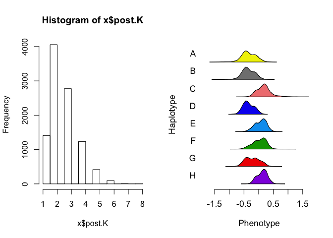
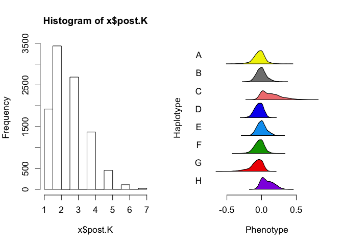
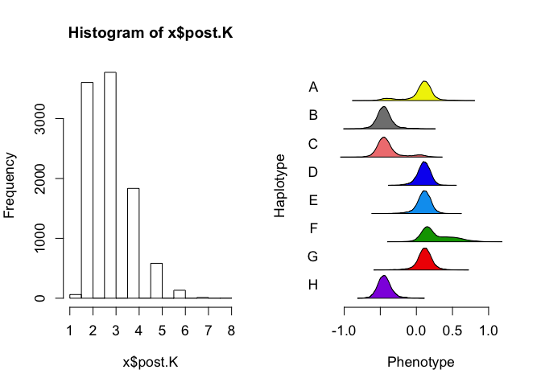

TIMBR: Allele effects in TnSeq Hotspots: One marker per trait
================
Frederick J. Boehm
11/15/2019

Last modified: 2019-11-15 20:35:31.

## Overview

We now consider only one marker per trait-hotspot pair. So, if a Neto
trait appears at more than one hotspot, it will be present more than
once below. However, if a trait is specific to a single hotspot, I
consider it at only one marker, its LOD peak marker within the hotspot.

``` r
library(dplyr)
```

    ## 
    ## Attaching package: 'dplyr'

    ## The following objects are masked from 'package:stats':
    ## 
    ##     filter, lag

    ## The following objects are masked from 'package:base':
    ## 
    ##     intersect, setdiff, setequal, union

``` r
library(TIMBR)
```

``` r
hots <- 1:10
```

``` r
probs <- readRDS("../data/genotypes_array.rds")
traits <- readRDS("../data/tnseq-traits.rds")
```

``` r
tt <- read.csv("../data/neto_traits_by_probe3_annotated.csv")
neto <- tt %>%
  tidyr::pivot_longer(cols = V2:V35, values_to = "trait", names_to = "trait_name") %>%
  dplyr::filter(!is.na(trait)) %>%
  dplyr::select(- trait_name, - neto.n, - row, - n.traits, - cM, -hs, - chr)
neto_plus <- tt %>%
  tidyr::pivot_longer(cols = V2:V35, values_to = "trait", names_to = "trait_name") %>%
  dplyr::filter(!is.na(trait)) %>%
  dplyr::select(- trait_name)

traits_timbr_annotated <- neto_plus %>%
  dplyr::select(probe, trait) %>%
  purrr::pmap( 
           .f = function(probe, trait){
             pheno <- traits[ , colnames(traits) == trait, drop = FALSE]
             geno <- probs[ , , dimnames(probs)[[3]] == probe]
             qtl2::fit1(genoprobs = geno, 
                        pheno = pheno, 
                        )
           }
             ) %>%
  purrr::map(.f = function(x){
    tibble::tibble(lod = x$lod)
  }) %>%
  bind_rows() %>%
  bind_cols(neto_plus) %>%
  dplyr::select(probe, trait, lod, hs) %>%
  dplyr::group_by(hs) %>%
  dplyr::group_by(trait) %>%
  dplyr::filter(lod == max(lod)) %>%
  dplyr::ungroup() %>%
  dplyr::ungroup()
```

## TIMBR setup

``` r
##### From GK example code
# Specify allelic series prior
# Suggested by Wes
# Influences how much prior weight it places on more or less complicated allelic series
prior_M <- list(model.type = "crp", # crp - Chinese Restaurant Process
                prior.alpha.type = "gamma",
                prior.alpha.shape = 1,
                prior.alpha.rate = 2.333415)
```

``` r
data(mcv.data) # get A matrix
```

``` r
tr_ann_sub <- traits_timbr_annotated %>%
  dplyr::filter(hs == params$hot) %>%
  dplyr::select(probe, trait)
neto_list <- apply(FUN = as.list, X = tr_ann_sub, MARGIN = 1)
neto_small <- neto_list[1:3]
```

``` r
outfn <- paste0("../data/timbr-tnseq-neto-traits-one-marker-per-trait-", params$hot, ".rds")
# ensure that inputs to call_timbr all have subjects in same order!
subject_ids <- rownames(traits)
##
indices_gp <- match(subject_ids, rownames(probs))
gp <- probs[indices_gp, , ]
##
if (!file.exists(outfn)){
  timbr_out <- parallel::mclapply(neto_list, 
  #timbr_out <- lapply(neto_small, 
                                  FUN = qtl2effects::call_timbr, 
                                  mc.cores = parallel::detectCores(),
                                  traits_df = traits,
                                  prior_M = prior_M, 
                                  genoprobs_array = gp,
                                  addcovar = NULL
                                  )
  saveRDS(timbr_out, outfn)
} else {
  timbr_out <- readRDS(outfn)
}
```

``` r
par(mfrow=c(1,2))    # set the plotting area into a 1*2 array
purrr::map(.x = timbr_out, .f = function(x){
  hist(x$post.K)
  TIMBR::TIMBR.plot.haplotypes(x)
}
  )
```

<!-- --><!-- --><!-- -->

    ## [[1]]
    ## NULL
    ## 
    ## [[2]]
    ## NULL
    ## 
    ## [[3]]
    ## NULL

# Pull out the most probable allelic series for each TIMBR analysis

We should add to our annotations table the LOD scores for every trait -
marker pair.

``` r
(t1 <- purrr::map(.x = timbr_out, 
           .f = function(x){
             foo <- x$p.M.given.y[1]
             tibble::tibble(posterior_prob = foo, 
                            allele_series = names(foo))
             }
           ) %>%
  dplyr::bind_rows()
)
```

    ## # A tibble: 3 x 2
    ##   posterior_prob allele_series  
    ##            <dbl> <chr>          
    ## 1          0.149 0,0,1,0,1,1,0,1
    ## 2          0.192 0,0,0,0,0,0,0,0
    ## 3          0.281 0,1,1,0,0,0,0,1
