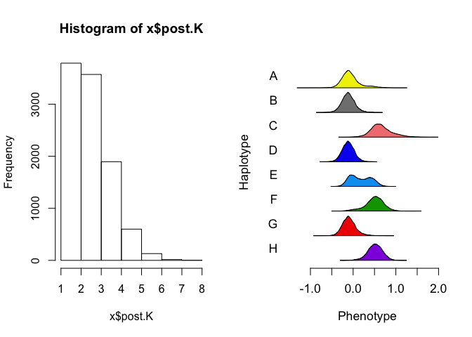
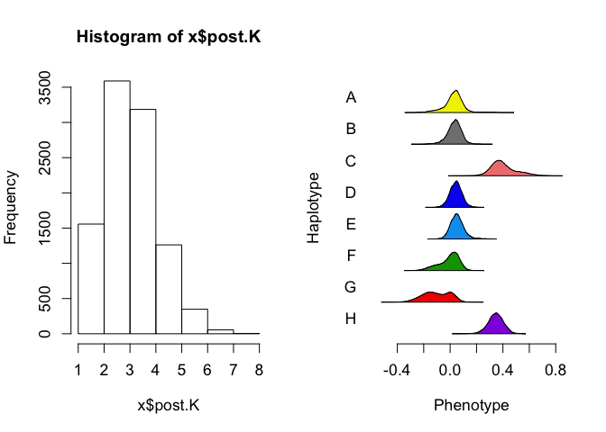
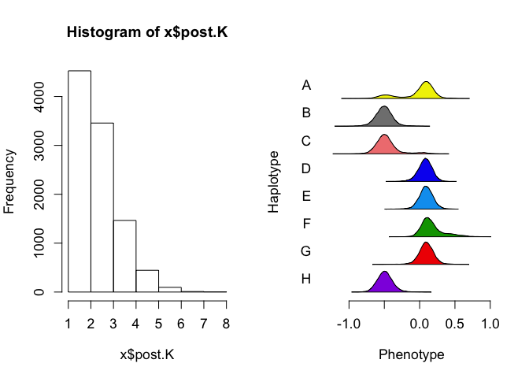
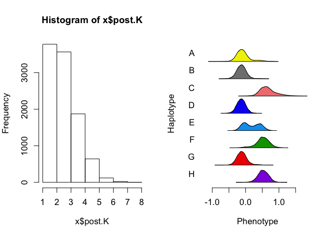
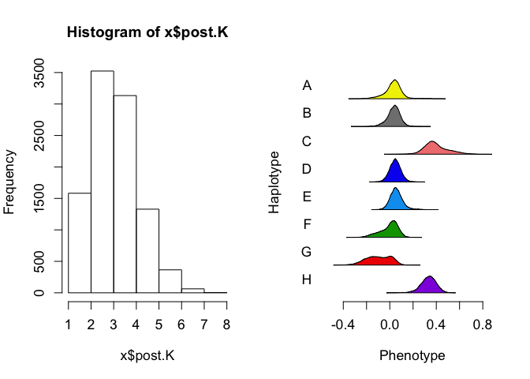
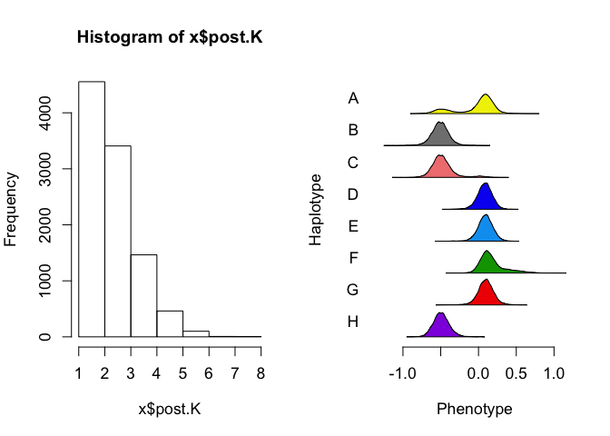
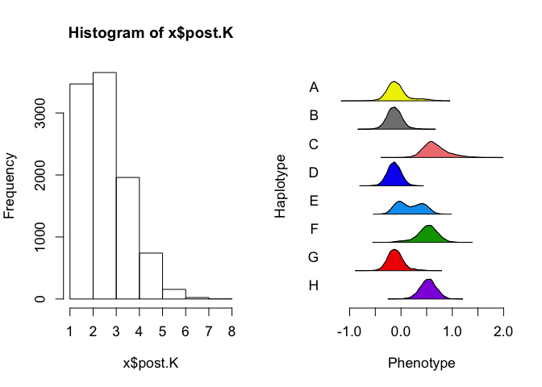
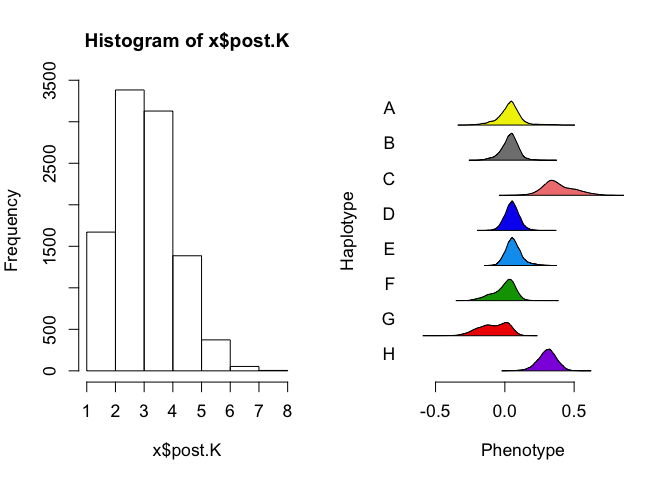

TnSeq Hotspot 1
================
Frederick J. Boehm
11/12/2019

Last modified: 2019-11-13
    09:27:06.

``` r
library(tidyverse)
```

    ## ── Attaching packages ─────────────────────────────────────── tidyverse 1.2.1 ──

    ## ✔ ggplot2 3.2.1     ✔ purrr   0.3.3
    ## ✔ tibble  2.1.3     ✔ dplyr   0.8.3
    ## ✔ tidyr   1.0.0     ✔ stringr 1.4.0
    ## ✔ readr   1.3.1     ✔ forcats 0.4.0

    ## ── Conflicts ────────────────────────────────────────── tidyverse_conflicts() ──
    ## ✖ dplyr::filter() masks stats::filter()
    ## ✖ dplyr::lag()    masks stats::lag()

``` r
fn <- "../data/timbr-tnseq-results-neto-hs1.rds"
timbr_out <- readRDS(fn)
```

``` r
par(mfrow=c(1,2))    # set the plotting area into a 1*2 array
purrr::map(.x = timbr_out, .f = function(x){
  hist(x$post.K, breaks = 9)
  TIMBR::TIMBR.plot.haplotypes(x)
}
  )
```

<!-- --><!-- --><!-- --><!-- --><!-- --><!-- --><!-- --><!-- --><!-- -->

    ## [[1]]
    ## NULL
    ## 
    ## [[2]]
    ## NULL
    ## 
    ## [[3]]
    ## NULL
    ## 
    ## [[4]]
    ## NULL
    ## 
    ## [[5]]
    ## NULL
    ## 
    ## [[6]]
    ## NULL
    ## 
    ## [[7]]
    ## NULL
    ## 
    ## [[8]]
    ## NULL
    ## 
    ## [[9]]
    ## NULL

# Pull out the most probable allelic series for each TIMBR analysis

We should add to our annotations table the LOD scores for every trait -
marker pair.

``` r
t1 <- purrr::map(.x = timbr_out, 
           .f = function(x){
             foo <- x$p.M.given.y[1]
             tibble::tibble(posterior_prob = foo, 
                            allele_series = names(foo))
             }
           ) %>%
  dplyr::bind_rows()
```

``` r
probs <- readRDS("../data/genotypes_array.rds")
```

``` r
tt <- read.csv("../data/neto_traits_by_probe3_annotated.csv")
neto <- tt %>%
  tidyr::pivot_longer(cols = V2:V35, values_to = "trait", names_to = "trait_name") %>%
  dplyr::filter(!is.na(trait)) %>%
  dplyr::select(- trait_name, - neto.n, - row, - n.traits, - cM, -hs, - chr)
neto_plus <- tt %>%
  tidyr::pivot_longer(cols = V2:V35, values_to = "trait", names_to = "trait_name") %>%
  dplyr::filter(!is.na(trait)) %>%
  dplyr::select(- trait_name)
```

``` r
load("../data/reduced_map_qtl2_mapping_objects.Rdata")
traits <- readRDS("../data/tnseq-traits.rds")
```

``` r
neto_plus %>%
  dplyr::filter(hs == 1) %>%
  dplyr::select(probe, trait) %>%
  purrr::pmap( 
           .f = function(probe, trait){
             pheno <- traits[ , colnames(traits) == trait, drop = FALSE]
             geno <- probs[ , , dimnames(probs)[[3]] == probe]
             qtl2::fit1(genoprobs = geno, 
                        pheno = pheno, 
                        addcovar = addcovar
                        )
           }
             ) %>%
  purrr::map(.f = function(x){
    tibble::tibble(lod = x$lod)
  }) %>%
  bind_rows() %>%
  dplyr::bind_cols(neto_plus[1:9, ]) %>%
  dplyr::select(- c(hs, n.traits, lod, neto.n, row), lod) %>%
  dplyr::bind_cols(t1)
```

    ## # A tibble: 9 x 7
    ##   probe       chr      cM trait        lod posterior_prob allele_series  
    ##   <fct>       <fct> <dbl> <fct>      <dbl>          <dbl> <chr>          
    ## 1 JAX00125549 4      64.8 RVBD_0309   8.38          0.176 0,0,1,0,0,1,0,1
    ## 2 JAX00125549 4      64.8 RVBD_1204c 12.6           0.151 0,0,1,0,0,0,0,1
    ## 3 JAX00125549 4      64.8 RVBD_3127   9.91          0.348 0,1,1,0,0,0,0,1
    ## 4 UNCHS013168 4      65.0 RVBD_0309   9.61          0.174 0,0,1,0,0,1,0,1
    ## 5 UNCHS013168 4      65.0 RVBD_1204c 13.2           0.149 0,0,1,0,0,0,0,1
    ## 6 UNCHS013168 4      65.0 RVBD_3127  10.1           0.344 0,1,1,0,0,0,0,1
    ## 7 UNCHS013176 4      65.1 RVBD_0309   9.51          0.169 0,0,1,0,0,1,0,1
    ## 8 UNCHS013176 4      65.1 RVBD_1204c 10.6           0.147 0,0,1,0,0,0,0,1
    ## 9 UNCHS013176 4      65.1 RVBD_3127   9.67          0.344 0,1,1,0,0,0,0,1
