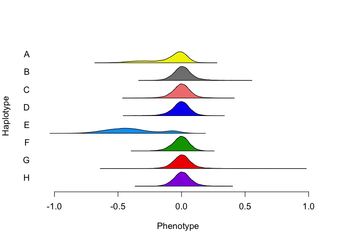

TIMBR: Allele effects in TnSeq Hotspots: One marker per trait for all 10
hotspots
================
Frederick J. Boehm
11/19/2019

Last modified: 2019-11-20 11:14:02.

## Overview

We now consider only one marker per trait-hotspot pair. So, if a Neto
trait appears at more than one hotspot, it will be present more than
once below. However, if a trait is specific to a single hotspot, I
consider it at only one marker, its LOD peak marker within the hotspot.

``` r
library(dplyr)
```

    ## 
    ## Attaching package: 'dplyr'

    ## The following objects are masked from 'package:stats':
    ## 
    ##     filter, lag

    ## The following objects are masked from 'package:base':
    ## 
    ##     intersect, setdiff, setequal, union

``` r
library(TIMBR)
```

``` r
probs <- readRDS("../data/genotypes_array.rds")
traits <- readRDS("../data/tnseq-traits.rds")
```

``` r
neto <- read.csv("../data/neto_traits_by_probe3_annotated.csv", stringsAsFactors = FALSE) %>%
  tidyr::pivot_longer(cols = V2:V35, 
                      values_to = "trait", 
                      names_to = "trait_name", 
                      values_drop_na = TRUE, 
                      values_ptypes = list(trait = character())) %>%
  dplyr::select(- trait_name) %>%
  dplyr::mutate(lod = 
           dplyr::select(., probe, trait) %>%
           purrr::pmap_dbl(
           .f = function(probe, trait){
             pheno <- traits[ , colnames(traits) == trait, drop = FALSE]
             geno <- probs[ , , dimnames(probs)[[3]] == probe]
             qtl2::fit1(genoprobs = geno, 
                        pheno = pheno, 
                        )$lod
           }
             )
  ) %>%
    dplyr::select(- cM, - neto.n, - row, - n.traits) %>%
    dplyr::group_by(hs) %>%
    dplyr::group_by(trait, add = TRUE) %>%
    dplyr::filter(lod == max(lod), .preserve = TRUE) %>%
  unique() %>% # needed due to multiple probes having same lod (which coincides with max lod within a group)
  ungroup()
```

## TIMBR setup

``` r
##### From GK example code
# Specify allelic series prior
# Suggested by Wes
# Influences how much prior weight it places on more or less complicated allelic series
prior_M <- list(model.type = "crp", # crp - Chinese Restaurant Process
                prior.alpha.type = "gamma",
                prior.alpha.shape = 1,
                prior.alpha.rate = 2.333415)
```

``` r
data(mcv.data) # get A matrix
```

``` r
 neto_list <- neto %>%
  dplyr::select(probe, trait) %>%
  apply(FUN = as.list, MARGIN = 1)
```

``` r
outfn <- paste0("../data/timbr-tnseq-neto-traits-one-marker-per-trait-all.rds")
# ensure that inputs to call_timbr all have subjects in same order!
subject_ids <- rownames(traits)
##
indices_gp <- match(subject_ids, rownames(probs))
gp <- probs[indices_gp, , ]
##
if (!file.exists(outfn)){
  timbr_out <- parallel::mclapply(neto_list, 
  #timbr_out <- lapply(neto_small, 
                                  FUN = qtl2effects::call_timbr, 
                                  mc.cores = parallel::detectCores(),
                                  traits_df = traits,
                                  prior_M = prior_M, 
                                  genoprobs_array = gp,
                                  addcovar = NULL
                                  )
  saveRDS(timbr_out, outfn)
} else {
  timbr_out <- readRDS(outfn)
}
names(timbr_out) <- neto$trait
```

``` r
annots <- neto %>%
  dplyr::mutate(allele_series = purrr::map(timbr_out, .f = function(x){
    pp <- x$p.M.given.y[1]
    return(tibble::tibble(series = names(pp), 
                   probability = pp
                   )
    )
    }
    )
                )
print(annots %>% tidyr::unnest(allele_series), n = 93)
```

    ## # A tibble: 93 x 7
    ##       hs probe       chr   trait        lod series          probability
    ##    <int> <chr>       <chr> <chr>      <dbl> <chr>                 <dbl>
    ##  1     1 UNCHS013168 4     RVBD_0309   5.94 0,0,1,0,1,1,0,1      0.142 
    ##  2     1 UNCHS013168 4     RVBD_1204c  9.08 0,0,0,0,0,0,0,0      0.203 
    ##  3     1 UNCHS013168 4     RVBD_3127  10.1  0,1,1,0,0,0,0,1      0.274 
    ##  4     2 UNC15592497 8     RVBD_3208A  9.77 0,1,0,0,0,0,0,0      0.158 
    ##  5     2 UNCHS024326 8     RVBD_2161c 10.8  0,1,0,1,0,1,0,1      0.124 
    ##  6     2 UNC15594067 8     RVBD_3236c 10.6  0,0,0,0,0,1,0,0      0.288 
    ##  7     3 UNCHS025952 9     RVBD_0961  10.0  0,0,0,0,0,0,0,0      0.383 
    ##  8     3 UNCHS025952 9     RVBD_2306A 13.2  0,0,0,0,0,1,0,0      0.375 
    ##  9     3 UNC16542567 9     RVBD_1405c  8.97 0,1,0,0,0,0,0,1      0.255 
    ## 10     3 UNC16548247 9     RVBD_3050c  8.72 0,0,0,1,0,1,0,0      0.294 
    ## 11     3 UNC16548247 9     RVBD_3813c  9.01 0,0,1,1,0,0,0,1      0.173 
    ## 12     4 UNC18908602 10    RVBD_0546c  9.08 0,0,0,0,0,0,0,0      0.459 
    ## 13     4 UNC18908602 10    RVBD_0590A  8.55 0,1,0,0,0,0,1,0      0.231 
    ## 14     4 UNC18908602 10    RVBD_0609  10.5  0,0,0,0,0,0,0,0      0.476 
    ## 15     4 UNC18908602 10    RVBD_0681  11.6  0,0,0,0,0,0,0,0      0.199 
    ## 16     4 UNC18908602 10    RVBD_1813c 12.1  0,0,1,0,1,0,0,1      0.100 
    ## 17     4 UNC18908602 10    RVBD_2297   7.48 0,0,0,0,0,0,0,0      0.496 
    ## 18     4 UNC18908602 10    RVBD_2375  16.8  0,0,0,0,1,0,0,0      0.434 
    ## 19     4 UNC18908602 10    RVBD_2427c 12.3  0,0,0,0,0,0,0,0      0.336 
    ## 20     4 UNC18908602 10    RVBD_2734   8.66 0,0,0,0,0,0,0,0      0.254 
    ## 21     4 UNC18908602 10    RVBD_2792c 10.5  0,1,0,0,0,0,0,0      0.258 
    ## 22     4 UNC18908602 10    RVBD_3229c  9.39 0,0,0,0,0,0,0,0      0.231 
    ## 23     4 UNC18908602 10    RVBD_0502  10.6  0,0,0,0,0,0,0,0      0.505 
    ## 24     4 UNC18908602 10    RVBD_2686c  7.59 0,0,0,0,0,0,0,0      0.297 
    ## 25     4 UNC18908602 10    RVBD_2985  10.4  0,0,0,0,0,0,0,0      0.311 
    ## 26     4 UNC18908602 10    RVBD_3647c 12.1  0,0,0,0,1,0,0,0      0.404 
    ## 27     4 UNC18908602 10    RVBD_2284   7.62 0,0,0,0,0,0,0,0      0.322 
    ## 28     4 UNC18908602 10    RVBD_2707   7.94 0,0,0,0,1,0,0,0      0.563 
    ## 29     4 UNC18908602 10    RVBD_1103c 11.1  0,0,0,0,0,0,0,0      0.516 
    ## 30     4 UNC18908602 10    RVBD_1283c 10.3  0,0,0,0,0,0,0,0      0.307 
    ## 31     4 UNC18908602 10    RVBD_3080c 11.9  0,0,0,0,0,0,0,0      0.531 
    ## 32     4 UNC18908602 10    RVBD_3550   9.61 0,0,0,0,0,0,0,0      0.430 
    ## 33     4 UNC18908602 10    RVBD_1141c  8.51 0,0,0,0,0,0,0,0      0.504 
    ## 34     4 UNC18908602 10    RVBD_2306A 10.3  0,0,0,0,0,0,0,0      0.508 
    ## 35     4 UNC18908602 10    RVBD_0999  11.4  0,0,0,0,0,0,0,0      0.447 
    ## 36     4 UNC18908602 10    RVBD_3744   8.92 0,1,0,0,0,0,0,0      0.483 
    ## 37     4 JAX00023365 10    RVBD_3701c  9.15 0,0,0,1,0,0,0,0      0.228 
    ## 38     4 JAX00301497 10    RVBD_1252c  7.41 0,0,0,0,0,0,0,0      0.311 
    ## 39     4 JAX00301497 10    RVBD_2175c  9.08 0,0,0,0,0,0,0,0      0.439 
    ## 40     4 JAX00301497 10    RVBD_3261  11.2  0,0,0,0,1,0,0,0      0.708 
    ## 41     4 JAX00301562 10    RVBD_3452  13.3  0,1,1,1,2,1,1,1      0.081 
    ## 42     4 JAX00301562 10    RVBD_3574   9.20 0,0,0,0,0,0,0,0      0.232 
    ## 43     4 JAX00301562 10    RVBD_0126   7.28 0,0,0,0,0,0,0,0      0.523 
    ## 44     4 JAX00301562 10    RVBD_0779c  5.68 0,0,0,0,0,0,0,0      0.499 
    ## 45     4 JAX00301562 10    RVBD_2731   5.15 0,0,0,0,0,0,0,0      0.586 
    ## 46     4 JAX00301562 10    RVBD_0131c  3.71 0,0,0,0,0,0,0,0      0.582 
    ## 47     4 UNCHS029516 10    RVBD_3099c  4.22 0,0,0,0,0,0,0,0      0.561 
    ## 48     5 UNC19829824 11    RVBD_2267c 11.7  0,1,2,1,1,1,1,1      0.236 
    ## 49     5 UNC19835870 11    RVBD_1103c  8.38 0,0,0,0,0,0,0,1      0.158 
    ## 50     6 JAX00320945 11    RVBD_0580c  8.16 0,0,0,0,0,0,0,0      0.241 
    ## 51     6 JAX00320945 11    RVBD_1794   6.63 0,0,1,0,0,0,0,0      0.492 
    ## 52     6 JAX00320945 11    RVBD_2959c  6.85 0,0,0,0,0,0,0,0      0.518 
    ## 53     6 JAX00320945 11    RVBD_3766  11.2  0,0,1,0,0,0,0,0      0.616 
    ## 54     6 UNCHS032178 11    RVBD_2281   8.92 0,0,0,0,0,0,0,0      0.246 
    ## 55     6 UNCHS032180 11    RVBD_2428   9.55 0,0,0,0,0,0,0,0      0.394 
    ## 56     6 UNCHS032180 11    RVBD_3267   5.15 0,0,0,0,0,0,0,0      0.576 
    ## 57     6 UNCHS032184 11    RVBD_0583c  8.24 0,0,0,0,0,0,0,0      0.476 
    ## 58     6 UNC20309343 11    RVBD_3392c  5.59 0,0,0,0,0,0,0,0      0.440 
    ## 59     6 JAX00321009 11    RVBD_3577   8.88 0,0,0,0,0,0,0,0      0.442 
    ## 60     6 JAX00321009 11    RVBD_3502c  5.52 0,0,0,0,0,0,0,0      0.535 
    ## 61     6 JAX00321009 11    RVBD_2985   6.52 0,1,1,1,1,1,1,1      0.323 
    ## 62     6 UNCHS032210 11    RVBD_0311   8.21 0,0,1,0,0,0,1,0      0.546 
    ## 63     6 UNCHS032210 11    RVBD_0784   9.08 0,0,0,0,1,1,0,0      0.224 
    ## 64     6 UNCHS032210 11    RVBD_3236c  9.95 0,0,0,0,0,0,0,0      0.174 
    ## 65     6 UNCHS032210 11    RVBD_0502   8.31 0,0,1,1,0,1,0,1      0.0727
    ## 66     6 UNCHS032210 11    RVBD_1813c  8.30 0,0,0,0,0,0,0,1      0.390 
    ## 67     6 UNCHS032210 11    RVBD_3426   6.10 0,0,0,0,0,0,0,0      0.236 
    ## 68     6 UNCHS032210 11    RVBD_1784   7.68 0,0,0,0,0,0,0,0      0.542 
    ## 69     6 UNCHS032210 11    RVBD_2458   6.27 0,0,0,0,0,0,0,0      0.320 
    ## 70     6 UNCHS032210 11    RVBD_2556c  9.00 0,0,0,0,0,0,0,0      0.529 
    ## 71     6 UNCHS032210 11    RVBD_3508   6.46 0,0,0,0,0,0,0,0      0.485 
    ## 72     6 UNCHS032210 11    RVBD_0825c  8.78 0,0,0,0,0,0,0,0      0.610 
    ## 73     6 UNCHS032210 11    RVBD_1804c  4.87 0,0,0,0,0,0,0,0      0.605 
    ## 74     6 UNC20317928 11    RVBD_2834c  8.05 0,0,0,0,0,0,0,0      0.282 
    ## 75     6 UNCHS032215 11    RVBD_0681   7.35 0,0,0,0,0,0,0,0      0.191 
    ## 76     6 UNCHS032215 11    RVBD_2179c  8.24 0,0,0,1,0,0,0,1      0.362 
    ## 77     6 UNCHS032215 11    RVBD_3127   7.41 0,0,0,0,0,0,0,0      0.154 
    ## 78     6 UNCHS032215 11    RVBD_3399   7.83 0,0,0,0,0,0,0,0      0.378 
    ## 79     6 JAX00031462 11    RVBD_1537   7.36 0,0,0,0,0,0,0,0      0.590 
    ## 80     7 UNC23444060 13    RVBD_0740   7.53 0,1,1,1,0,1,1,1      0.247 
    ## 81     7 UNC23444060 13    RVBD_1405c  7.59 0,1,1,0,1,0,1,0      0.311 
    ## 82     7 UNC23444060 13    RVBD_2499c  7.45 0,0,0,1,0,0,0,0      0.329 
    ## 83     7 UNC23444060 13    RVBD_2515c  8.76 0,0,0,0,1,0,1,0      0.129 
    ## 84     7 UNC23444060 13    RVBD_3516  12.3  0,0,0,1,0,0,0,0      0.892 
    ## 85     8 UNC23978836 14    RVBD_2284  12.5  0,0,1,1,1,1,1,0      0.066 
    ## 86     8 UNC23979305 14    RVBD_0590A 16.4  0,0,1,1,0,1,0,1      0.154 
    ## 87     8 UNC23979305 14    RVBD_2499c 10.5  0,0,1,1,1,1,1,1      0.170 
    ## 88     8 UNC23979305 14    RVBD_3369  12.2  0,0,0,0,0,0,1,0      0.557 
    ## 89     9 UNCHS045394 18    RVBD_2372c 13.9  0,0,0,0,0,1,0,0      0.703 
    ## 90     9 UNC28701299 18    RVBD_0492c 16.2  0,0,0,0,0,1,0,0      0.610 
    ## 91     9 UNC28701299 18    RVBD_1705c 13.0  0,0,0,0,0,1,0,0      0.401 
    ## 92    10 UNCHS048205 X     RVBD_0501   8.64 0,0,0,0,0,0,1,0      0.106 
    ## 93    10 UNCHS048205 X     RVBD_0502   5.02 0,0,0,0,0,0,1,0      0.436

The annotations for each plot appear before the plot.

``` r
for (i in seq_along(timbr_out)){
  print(paste0(annots[i, ], collapse = " "))
  TIMBR::TIMBR.plot.haplotypes(timbr_out[[i]])
}
```

    ## [1] "1 UNCHS013168 4 RVBD_0309 5.93604567415352 list(RVBD_0309 = list(series = \"0,0,1,0,1,1,0,1\", probability = 0.1419))"

<!-- -->

    ## [1] "1 UNCHS013168 4 RVBD_1204c 9.08152179091921 list(RVBD_1204c = list(series = \"0,0,0,0,0,0,0,0\", probability = 0.2033))"

<!-- -->

    ## [1] "1 UNCHS013168 4 RVBD_3127 10.0884002918285 list(RVBD_3127 = list(series = \"0,1,1,0,0,0,0,1\", probability = 0.2738))"

<!-- -->

    ## [1] "2 UNC15592497 8 RVBD_3208A 9.77425826430606 list(RVBD_3208A = list(series = \"0,1,0,0,0,0,0,0\", probability = 0.1575))"

<!-- -->

    ## [1] "2 UNCHS024326 8 RVBD_2161c 10.7934870942949 list(RVBD_2161c = list(series = \"0,1,0,1,0,1,0,1\", probability = 0.124))"

<!-- -->

    ## [1] "2 UNC15594067 8 RVBD_3236c 10.5955421451551 list(RVBD_3236c = list(series = \"0,0,0,0,0,1,0,0\", probability = 0.2881))"

<!-- -->

    ## [1] "3 UNCHS025952 9 RVBD_0961 10.0479683434846 list(RVBD_0961 = list(series = \"0,0,0,0,0,0,0,0\", probability = 0.3828))"

<!-- -->

    ## [1] "3 UNCHS025952 9 RVBD_2306A 13.2273219944818 list(RVBD_2306A = list(series = \"0,0,0,0,0,1,0,0\", probability = 0.3752))"

<!-- -->

    ## [1] "3 UNC16542567 9 RVBD_1405c 8.97185237519652 list(RVBD_1405c = list(series = \"0,1,0,0,0,0,0,1\", probability = 0.2548))"

<!-- -->

    ## [1] "3 UNC16548247 9 RVBD_3050c 8.71675404156323 list(RVBD_3050c = list(series = \"0,0,0,1,0,1,0,0\", probability = 0.294))"

<!-- -->

    ## [1] "3 UNC16548247 9 RVBD_3813c 9.00742729711044 list(RVBD_3813c = list(series = \"0,0,1,1,0,0,0,1\", probability = 0.1733))"

<!-- -->

    ## [1] "4 UNC18908602 10 RVBD_0546c 9.07753547382722 list(RVBD_0546c = list(series = \"0,0,0,0,0,0,0,0\", probability = 0.4592))"

<!-- -->

    ## [1] "4 UNC18908602 10 RVBD_0590A 8.55120364692678 list(RVBD_0590A = list(series = \"0,1,0,0,0,0,1,0\", probability = 0.2313))"

<!-- -->

    ## [1] "4 UNC18908602 10 RVBD_0609 10.4747607363776 list(RVBD_0609 = list(series = \"0,0,0,0,0,0,0,0\", probability = 0.4756))"

<!-- -->

    ## [1] "4 UNC18908602 10 RVBD_0681 11.5764454821179 list(RVBD_0681 = list(series = \"0,0,0,0,0,0,0,0\", probability = 0.1989))"

<!-- -->

    ## [1] "4 UNC18908602 10 RVBD_1813c 12.1254978564107 list(RVBD_1813c = list(series = \"0,0,1,0,1,0,0,1\", probability = 0.1003))"

<!-- -->

    ## [1] "4 UNC18908602 10 RVBD_2297 7.48007352160539 list(RVBD_2297 = list(series = \"0,0,0,0,0,0,0,0\", probability = 0.4956))"

<!-- -->

    ## [1] "4 UNC18908602 10 RVBD_2375 16.7759059493217 list(RVBD_2375 = list(series = \"0,0,0,0,1,0,0,0\", probability = 0.4343))"

<!-- -->

    ## [1] "4 UNC18908602 10 RVBD_2427c 12.2968570659925 list(RVBD_2427c = list(series = \"0,0,0,0,0,0,0,0\", probability = 0.3362))"

<!-- -->

    ## [1] "4 UNC18908602 10 RVBD_2734 8.65907109085841 list(RVBD_2734 = list(series = \"0,0,0,0,0,0,0,0\", probability = 0.2538))"

<!-- -->

    ## [1] "4 UNC18908602 10 RVBD_2792c 10.4913993674844 list(RVBD_2792c = list(series = \"0,1,0,0,0,0,0,0\", probability = 0.2575))"

<!-- -->

    ## [1] "4 UNC18908602 10 RVBD_3229c 9.38789779515418 list(RVBD_3229c = list(series = \"0,0,0,0,0,0,0,0\", probability = 0.2308))"

<!-- -->

    ## [1] "4 UNC18908602 10 RVBD_0502 10.6256487366276 list(RVBD_0502 = list(series = \"0,0,0,0,0,0,0,0\", probability = 0.5055))"

<!-- -->

    ## [1] "4 UNC18908602 10 RVBD_2686c 7.59452532936451 list(RVBD_2686c = list(series = \"0,0,0,0,0,0,0,0\", probability = 0.297))"

<!-- -->

    ## [1] "4 UNC18908602 10 RVBD_2985 10.3553841765877 list(RVBD_2985 = list(series = \"0,0,0,0,0,0,0,0\", probability = 0.3107))"

<!-- -->

    ## [1] "4 UNC18908602 10 RVBD_3647c 12.0840155676201 list(RVBD_3647c = list(series = \"0,0,0,0,1,0,0,0\", probability = 0.404))"

<!-- -->

    ## [1] "4 UNC18908602 10 RVBD_2284 7.62302553474388 list(RVBD_2284 = list(series = \"0,0,0,0,0,0,0,0\", probability = 0.3225))"

<!-- -->

    ## [1] "4 UNC18908602 10 RVBD_2707 7.94361873982369 list(RVBD_2707 = list(series = \"0,0,0,0,1,0,0,0\", probability = 0.5628))"

<!-- -->

    ## [1] "4 UNC18908602 10 RVBD_1103c 11.109461049055 list(RVBD_1103c = list(series = \"0,0,0,0,0,0,0,0\", probability = 0.5159))"

<!-- -->

    ## [1] "4 UNC18908602 10 RVBD_1283c 10.273720703816 list(RVBD_1283c = list(series = \"0,0,0,0,0,0,0,0\", probability = 0.3069))"

<!-- -->

    ## [1] "4 UNC18908602 10 RVBD_3080c 11.9000178903669 list(RVBD_3080c = list(series = \"0,0,0,0,0,0,0,0\", probability = 0.531))"

<!-- -->

    ## [1] "4 UNC18908602 10 RVBD_3550 9.611588540796 list(RVBD_3550 = list(series = \"0,0,0,0,0,0,0,0\", probability = 0.4301))"

<!-- -->

    ## [1] "4 UNC18908602 10 RVBD_1141c 8.51063620031551 list(RVBD_1141c = list(series = \"0,0,0,0,0,0,0,0\", probability = 0.504))"

<!-- -->

    ## [1] "4 UNC18908602 10 RVBD_2306A 10.2828818113961 list(RVBD_2306A = list(series = \"0,0,0,0,0,0,0,0\", probability = 0.5078))"

<!-- -->

    ## [1] "4 UNC18908602 10 RVBD_0999 11.4226255386058 list(RVBD_0999 = list(series = \"0,0,0,0,0,0,0,0\", probability = 0.4471))"

<!-- -->

    ## [1] "4 UNC18908602 10 RVBD_3744 8.91683933614751 list(RVBD_3744 = list(series = \"0,1,0,0,0,0,0,0\", probability = 0.4832))"

<!-- -->

    ## [1] "4 JAX00023365 10 RVBD_3701c 9.14708696578496 list(RVBD_3701c = list(series = \"0,0,0,1,0,0,0,0\", probability = 0.2282))"

<!-- -->

    ## [1] "4 JAX00301497 10 RVBD_1252c 7.41091278503986 list(RVBD_1252c = list(series = \"0,0,0,0,0,0,0,0\", probability = 0.311))"

<!-- -->

    ## [1] "4 JAX00301497 10 RVBD_2175c 9.07664566749445 list(RVBD_2175c = list(series = \"0,0,0,0,0,0,0,0\", probability = 0.4387))"

<!-- -->

    ## [1] "4 JAX00301497 10 RVBD_3261 11.2298782935176 list(RVBD_3261 = list(series = \"0,0,0,0,1,0,0,0\", probability = 0.7076))"

<!-- -->

    ## [1] "4 JAX00301562 10 RVBD_3452 13.3047989070986 list(RVBD_3452 = list(series = \"0,1,1,1,2,1,1,1\", probability = 0.081))"

<!-- -->

    ## [1] "4 JAX00301562 10 RVBD_3574 9.19672442607343 list(RVBD_3574 = list(series = \"0,0,0,0,0,0,0,0\", probability = 0.2319))"

<!-- -->

    ## [1] "4 JAX00301562 10 RVBD_0126 7.28171612511743 list(RVBD_0126 = list(series = \"0,0,0,0,0,0,0,0\", probability = 0.5231))"

<!-- -->

    ## [1] "4 JAX00301562 10 RVBD_0779c 5.67760492781489 list(RVBD_0779c = list(series = \"0,0,0,0,0,0,0,0\", probability = 0.4986))"

<!-- -->

    ## [1] "4 JAX00301562 10 RVBD_2731 5.15088596048493 list(RVBD_2731 = list(series = \"0,0,0,0,0,0,0,0\", probability = 0.5863))"

<!-- -->

    ## [1] "4 JAX00301562 10 RVBD_0131c 3.71391898401126 list(RVBD_0131c = list(series = \"0,0,0,0,0,0,0,0\", probability = 0.5818))"

<!-- -->

    ## [1] "4 UNCHS029516 10 RVBD_3099c 4.22424774078066 list(RVBD_3099c = list(series = \"0,0,0,0,0,0,0,0\", probability = 0.5607))"

<!-- -->

    ## [1] "5 UNC19829824 11 RVBD_2267c 11.6588418776685 list(RVBD_2267c = list(series = \"0,1,2,1,1,1,1,1\", probability = 0.2362))"

<!-- -->

    ## [1] "5 UNC19835870 11 RVBD_1103c 8.37641400053001 list(RVBD_1103c = list(series = \"0,0,0,0,0,0,0,1\", probability = 0.1581))"

<!-- -->

    ## [1] "6 JAX00320945 11 RVBD_0580c 8.15737478178288 list(RVBD_0580c = list(series = \"0,0,0,0,0,0,0,0\", probability = 0.2414))"

<!-- -->

    ## [1] "6 JAX00320945 11 RVBD_1794 6.63494591617533 list(RVBD_1794 = list(series = \"0,0,1,0,0,0,0,0\", probability = 0.4919))"

<!-- -->

    ## [1] "6 JAX00320945 11 RVBD_2959c 6.85104295662477 list(RVBD_2959c = list(series = \"0,0,0,0,0,0,0,0\", probability = 0.5177))"

<!-- -->

    ## [1] "6 JAX00320945 11 RVBD_3766 11.1584203205291 list(RVBD_3766 = list(series = \"0,0,1,0,0,0,0,0\", probability = 0.6162))"

<!-- -->

    ## [1] "6 UNCHS032178 11 RVBD_2281 8.9214144139527 list(RVBD_2281 = list(series = \"0,0,0,0,0,0,0,0\", probability = 0.2459))"

<!-- -->

    ## [1] "6 UNCHS032180 11 RVBD_2428 9.54893035743058 list(RVBD_2428 = list(series = \"0,0,0,0,0,0,0,0\", probability = 0.3943))"

<!-- -->

    ## [1] "6 UNCHS032180 11 RVBD_3267 5.15384128983978 list(RVBD_3267 = list(series = \"0,0,0,0,0,0,0,0\", probability = 0.5756))"

<!-- -->

    ## [1] "6 UNCHS032184 11 RVBD_0583c 8.2425835366901 list(RVBD_0583c = list(series = \"0,0,0,0,0,0,0,0\", probability = 0.4757))"

<!-- -->

    ## [1] "6 UNC20309343 11 RVBD_3392c 5.59187195240017 list(RVBD_3392c = list(series = \"0,0,0,0,0,0,0,0\", probability = 0.4404))"

<!-- -->

    ## [1] "6 JAX00321009 11 RVBD_3577 8.88043974736859 list(RVBD_3577 = list(series = \"0,0,0,0,0,0,0,0\", probability = 0.4415))"

<!-- -->

    ## [1] "6 JAX00321009 11 RVBD_3502c 5.52144359802291 list(RVBD_3502c = list(series = \"0,0,0,0,0,0,0,0\", probability = 0.5346))"

<!-- -->

    ## [1] "6 JAX00321009 11 RVBD_2985 6.51677922634659 list(RVBD_2985 = list(series = \"0,1,1,1,1,1,1,1\", probability = 0.323))"

<!-- -->

    ## [1] "6 UNCHS032210 11 RVBD_0311 8.21062743577694 list(RVBD_0311 = list(series = \"0,0,1,0,0,0,1,0\", probability = 0.546))"

<!-- -->

    ## [1] "6 UNCHS032210 11 RVBD_0784 9.08404088250032 list(RVBD_0784 = list(series = \"0,0,0,0,1,1,0,0\", probability = 0.2235))"

<!-- -->

    ## [1] "6 UNCHS032210 11 RVBD_3236c 9.94719199059069 list(RVBD_3236c = list(series = \"0,0,0,0,0,0,0,0\", probability = 0.1742))"

<!-- -->

    ## [1] "6 UNCHS032210 11 RVBD_0502 8.30734743534915 list(RVBD_0502 = list(series = \"0,0,1,1,0,1,0,1\", probability = 0.0727))"

<!-- -->

    ## [1] "6 UNCHS032210 11 RVBD_1813c 8.30350289649793 list(RVBD_1813c = list(series = \"0,0,0,0,0,0,0,1\", probability = 0.3896))"

<!-- -->

    ## [1] "6 UNCHS032210 11 RVBD_3426 6.09731170611434 list(RVBD_3426 = list(series = \"0,0,0,0,0,0,0,0\", probability = 0.236))"

<!-- -->

    ## [1] "6 UNCHS032210 11 RVBD_1784 7.67609701361525 list(RVBD_1784 = list(series = \"0,0,0,0,0,0,0,0\", probability = 0.5423))"

<!-- -->

    ## [1] "6 UNCHS032210 11 RVBD_2458 6.2670108635969 list(RVBD_2458 = list(series = \"0,0,0,0,0,0,0,0\", probability = 0.3202))"

<!-- -->

    ## [1] "6 UNCHS032210 11 RVBD_2556c 9.00261012749163 list(RVBD_2556c = list(series = \"0,0,0,0,0,0,0,0\", probability = 0.5287))"

<!-- -->

    ## [1] "6 UNCHS032210 11 RVBD_3508 6.46360236575417 list(RVBD_3508 = list(series = \"0,0,0,0,0,0,0,0\", probability = 0.4848))"

<!-- -->

    ## [1] "6 UNCHS032210 11 RVBD_0825c 8.77717654606155 list(RVBD_0825c = list(series = \"0,0,0,0,0,0,0,0\", probability = 0.6097))"

<!-- -->

    ## [1] "6 UNCHS032210 11 RVBD_1804c 4.87299142563849 list(RVBD_1804c = list(series = \"0,0,0,0,0,0,0,0\", probability = 0.6054))"

<!-- -->

    ## [1] "6 UNC20317928 11 RVBD_2834c 8.04824761277547 list(RVBD_2834c = list(series = \"0,0,0,0,0,0,0,0\", probability = 0.2815))"

<!-- -->

    ## [1] "6 UNCHS032215 11 RVBD_0681 7.35435844880236 list(RVBD_0681 = list(series = \"0,0,0,0,0,0,0,0\", probability = 0.1909))"

<!-- -->

    ## [1] "6 UNCHS032215 11 RVBD_2179c 8.24058391260052 list(RVBD_2179c = list(series = \"0,0,0,1,0,0,0,1\", probability = 0.3618))"

<!-- -->

    ## [1] "6 UNCHS032215 11 RVBD_3127 7.41170366577177 list(RVBD_3127 = list(series = \"0,0,0,0,0,0,0,0\", probability = 0.1543))"

<!-- -->

    ## [1] "6 UNCHS032215 11 RVBD_3399 7.83389674433684 list(RVBD_3399 = list(series = \"0,0,0,0,0,0,0,0\", probability = 0.3783))"

<!-- -->

    ## [1] "6 JAX00031462 11 RVBD_1537 7.36300865634755 list(RVBD_1537 = list(series = \"0,0,0,0,0,0,0,0\", probability = 0.5903))"

<!-- -->

    ## [1] "7 UNC23444060 13 RVBD_0740 7.53275003268254 list(RVBD_0740 = list(series = \"0,1,1,1,0,1,1,1\", probability = 0.2474))"

<!-- -->

    ## [1] "7 UNC23444060 13 RVBD_1405c 7.59005453572285 list(RVBD_1405c = list(series = \"0,1,1,0,1,0,1,0\", probability = 0.3108))"

<!-- -->

    ## [1] "7 UNC23444060 13 RVBD_2499c 7.44991115556341 list(RVBD_2499c = list(series = \"0,0,0,1,0,0,0,0\", probability = 0.329))"

<!-- -->

    ## [1] "7 UNC23444060 13 RVBD_2515c 8.76361725735995 list(RVBD_2515c = list(series = \"0,0,0,0,1,0,1,0\", probability = 0.1294))"

<!-- -->

    ## [1] "7 UNC23444060 13 RVBD_3516 12.3424961823568 list(RVBD_3516 = list(series = \"0,0,0,1,0,0,0,0\", probability = 0.892))"

<!-- -->

    ## [1] "8 UNC23978836 14 RVBD_2284 12.507987566478 list(RVBD_2284 = list(series = \"0,0,1,1,1,1,1,0\", probability = 0.066))"

<!-- -->

    ## [1] "8 UNC23979305 14 RVBD_0590A 16.4471101738308 list(RVBD_0590A = list(series = \"0,0,1,1,0,1,0,1\", probability = 0.1537))"

<!-- -->

    ## [1] "8 UNC23979305 14 RVBD_2499c 10.5416581470618 list(RVBD_2499c = list(series = \"0,0,1,1,1,1,1,1\", probability = 0.1704))"

<!-- -->

    ## [1] "8 UNC23979305 14 RVBD_3369 12.2394083412225 list(RVBD_3369 = list(series = \"0,0,0,0,0,0,1,0\", probability = 0.5574))"

<!-- -->

    ## [1] "9 UNCHS045394 18 RVBD_2372c 13.8955759035634 list(RVBD_2372c = list(series = \"0,0,0,0,0,1,0,0\", probability = 0.7033))"

<!-- -->

    ## [1] "9 UNC28701299 18 RVBD_0492c 16.2393552401678 list(RVBD_0492c = list(series = \"0,0,0,0,0,1,0,0\", probability = 0.6097))"

<!-- -->

    ## [1] "9 UNC28701299 18 RVBD_1705c 12.9761874056897 list(RVBD_1705c = list(series = \"0,0,0,0,0,1,0,0\", probability = 0.4006))"

<!-- -->

    ## [1] "10 UNCHS048205 X RVBD_0501 8.6361783315942 list(RVBD_0501 = list(series = \"0,0,0,0,0,0,1,0\", probability = 0.1057))"

<!-- -->

    ## [1] "10 UNCHS048205 X RVBD_0502 5.02072244343152 list(RVBD_0502 = list(series = \"0,0,0,0,0,0,1,0\", probability = 0.4355))"

<!-- -->

``` r
readr::write_csv(annots %>% tidyr::unnest(allele_series), path = "../data/tnseq-neto-traits-annotated-10-hotspots.csv")
```
