TIMBR: Allele effects in TnSeq Hotspots: One marker per trait for all 10 hotspots
================
Frederick J. Boehm
11/21/2019

Last modified: 2019-11-22 09:26:27.

## Overview

We now consider only one marker per trait-hotspot pair. The set of
traits differs from those in previous analyses. We now read a csv file
that I made by hand from Rick Baker’s html file.

``` r
library(dplyr)
```

    ## 
    ## Attaching package: 'dplyr'

    ## The following objects are masked from 'package:stats':
    ## 
    ##     filter, lag

    ## The following objects are masked from 'package:base':
    ## 
    ##     intersect, setdiff, setequal, union

``` r
library(TIMBR)
```

``` r
aprobs <- readRDS("../data/aprobs.rds")
map <- readRDS("../data/map.rds")
probs <- readRDS("../data/genotypes_array.rds")
traits <- readRDS("../data/tnseq-traits.rds")
```

``` r
trait_ann <- readr::read_csv("../data/v2_byhand_hotspot_tnseq_traits.csv")
```

    ## Parsed with column specification:
    ## cols(
    ##   hs = col_double(),
    ##   trait = col_character()
    ## )

## Run `scan1` on each trait

``` r
pheno <- traits[ , match(trait_ann$trait, colnames(traits)),
                 drop = FALSE]
s1out <- qtl2::scan1(aprobs, pheno)
# check if every trait is represented in table, and where it should be!
hot_chr <- c("4", "8", "9", "10", "11", "11", "13", "14", "18", "X") 
hot_index <- 1:10
hs_ann <- tibble::tibble(hs = hot_index, chr = hot_chr) %>%
  dplyr::right_join(trait_ann, by = "hs")

ann_all <- qtl2::find_peaks(s1out, map = map, threshold = 4) %>%
  tibble::as_tibble() %>%
  dplyr::filter(as.character(chr) %in% hot_chr) %>%
  dplyr::full_join(hs_ann, by = c("lodcolumn" = "trait", "chr")) %>%
  dplyr::filter(!is.na(hs)) %>%
  dplyr::arrange(hs) %>%
  dplyr::rename(trait = lodcolumn) %>%
  dplyr::select( - lodindex) %>%
  dplyr::left_join(tibble(marker = names(unlist(map)), pos = unlist(map)), by = "pos" ) %>%
  dplyr::mutate(splitted = stringr::str_split(marker, 
                                                    pattern = "\\."
  )
                                                     %>%
                          sapply(FUN = function(x)x[2])
                ) 
```

    ## Warning: Column `chr` joining factor and character vector, coercing into
    ## character vector

## TIMBR setup

``` r
##### From GK example code
# Specify allelic series prior
# Suggested by Wes
# Influences how much prior weight it places on more or less complicated allelic series
prior_M <- list(model.type = "crp", # crp - Chinese Restaurant Process
                prior.alpha.type = "gamma",
                prior.alpha.shape = 1,
                prior.alpha.rate = 2.333415)
```

``` r
data(mcv.data) # get A matrix
```

``` r
 neto_list <- ann_all %>%
  dplyr::rename(probe = splitted) %>%
  dplyr::select(probe, trait) %>%
  apply(FUN = as.list, MARGIN = 1)
```

``` r
outfn <- paste0("../data/suggestive-timbr-tnseq-neto-traits-one-marker-per-trait-all.rds")
# ensure that inputs to call_timbr all have subjects in same order!
subject_ids <- rownames(traits)
##
indices_gp <- match(subject_ids, rownames(probs))
gp <- probs[indices_gp, , ]
##
if (!file.exists(outfn)){
  timbr_out <- parallel::mclapply(neto_list, 
  #timbr_out <- lapply(neto_small, 
                                  FUN = qtl2effects::call_timbr, 
                                  mc.cores = parallel::detectCores(),
                                  traits_df = traits,
                                  prior_M = prior_M, 
                                  genoprobs_array = gp,
                                  addcovar = NULL
                                  )
  saveRDS(timbr_out, outfn)
} else {
  timbr_out <- readRDS(outfn)
}
names(timbr_out) <- trait_ann$trait
```

``` r
annots <- hs_ann %>%
  dplyr::mutate(allele_series = purrr::map(timbr_out, .f = function(x){
    pp <- x$p.M.given.y[1]
    return(tibble::tibble(series = names(pp), 
                   probability = pp
                   )
    )
    }
    )
                )
print(annots %>% tidyr::unnest(allele_series))
```

    ## # A tibble: 69 x 5
    ##       hs chr   trait      series          probability
    ##    <dbl> <chr> <chr>      <chr>                 <dbl>
    ##  1     1 4     RVBD_0309  0,0,1,0,1,1,1,1      0.305 
    ##  2     1 4     RVBD_1204c 0,0,0,0,0,0,0,0      0.116 
    ##  3     1 4     RVBD_3127  0,1,1,0,0,0,0,1      0.282 
    ##  4     2 8     RVBD_0789c 0,1,0,0,0,1,1,1      0.178 
    ##  5     2 8     RVBD_0901  0,1,2,1,2,0,1,1      0.0881
    ##  6     2 8     RVBD_2161c 0,1,0,1,0,1,0,1      0.115 
    ##  7     2 8     RVBD_2466c 0,0,0,0,0,0,0,0      0.221 
    ##  8     2 8     RVBD_3208A 0,1,0,0,0,0,0,0      0.145 
    ##  9     2 8     RVBD_3236c 0,0,0,0,0,1,0,0      0.265 
    ## 10     2 8     RVBD_3394c 0,0,1,0,2,2,0,0      0.0716
    ## # … with 59 more rows

The annotations for each plot appear before the plot.

``` r
for (i in seq_along(timbr_out)){
  print(paste0(annots[i, ], collapse = " "))
  TIMBR::TIMBR.plot.haplotypes(timbr_out[[i]])
}
```

    ## [1] "1 4 RVBD_0309 list(RVBD_0309 = list(series = \"0,0,1,0,1,1,1,1\", probability = 0.3046))"

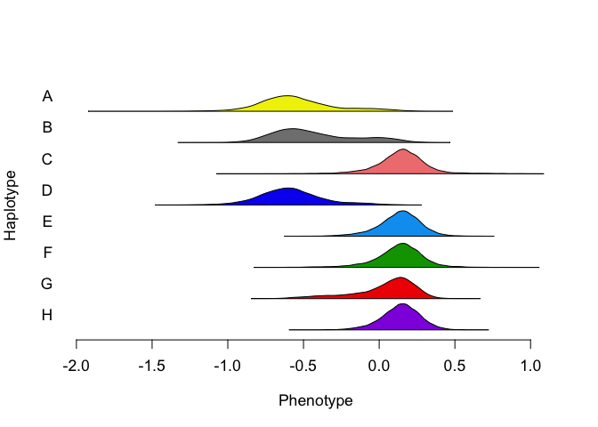<!-- -->

    ## [1] "1 4 RVBD_1204c list(RVBD_1204c = list(series = \"0,0,0,0,0,0,0,0\", probability = 0.1159))"

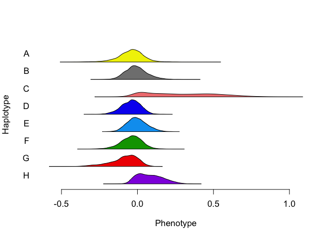<!-- -->

    ## [1] "1 4 RVBD_3127 list(RVBD_3127 = list(series = \"0,1,1,0,0,0,0,1\", probability = 0.2815))"

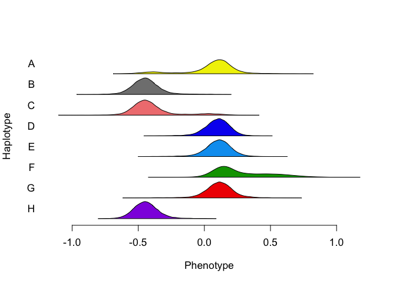<!-- -->

    ## [1] "2 8 RVBD_0789c list(RVBD_0789c = list(series = \"0,1,0,0,0,1,1,1\", probability = 0.178))"

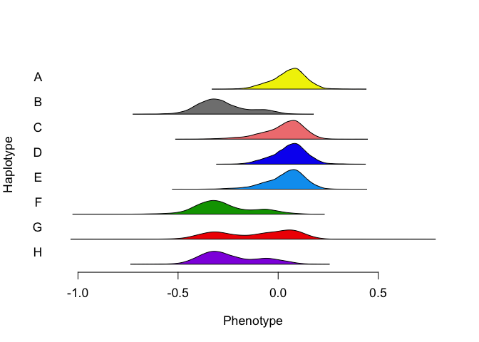<!-- -->

    ## [1] "2 8 RVBD_0901 list(RVBD_0901 = list(series = \"0,1,2,1,2,0,1,1\", probability = 0.0881))"

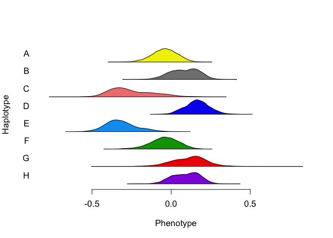<!-- -->

    ## [1] "2 8 RVBD_2161c list(RVBD_2161c = list(series = \"0,1,0,1,0,1,0,1\", probability = 0.1151))"

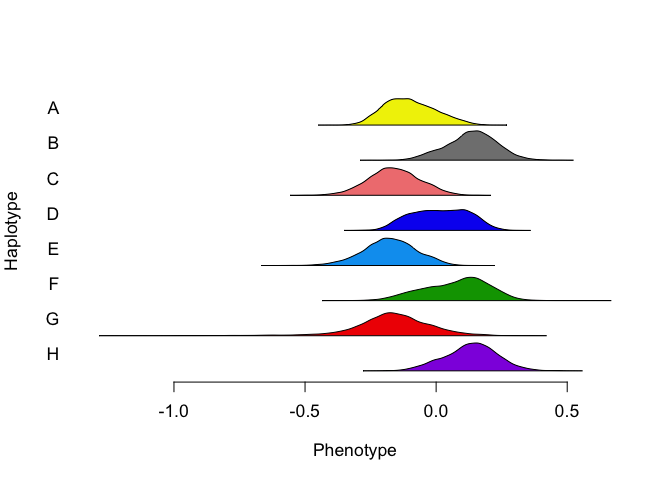<!-- -->

    ## [1] "2 8 RVBD_2466c list(RVBD_2466c = list(series = \"0,0,0,0,0,0,0,0\", probability = 0.2206))"

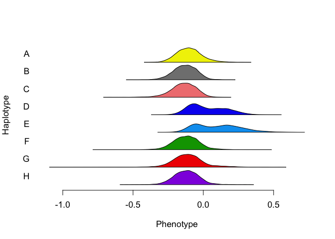<!-- -->

    ## [1] "2 8 RVBD_3208A list(RVBD_3208A = list(series = \"0,1,0,0,0,0,0,0\", probability = 0.1454))"

<!-- -->

    ## [1] "2 8 RVBD_3236c list(RVBD_3236c = list(series = \"0,0,0,0,0,1,0,0\", probability = 0.2647))"

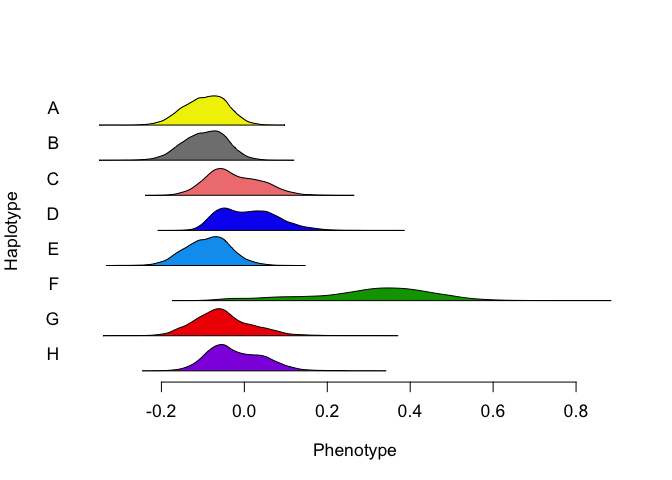<!-- -->

    ## [1] "2 8 RVBD_3394c list(RVBD_3394c = list(series = \"0,0,1,0,2,2,0,0\", probability = 0.0716))"

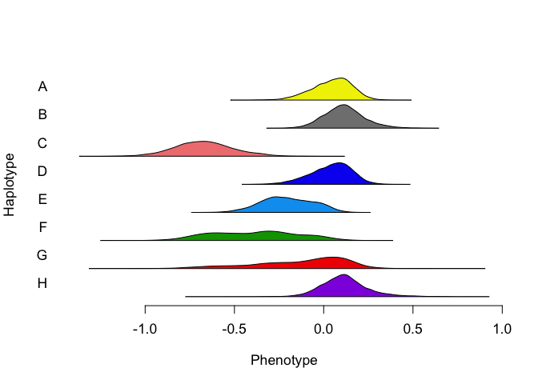<!-- -->

    ## [1] "3 9 RVBD_0490 list(RVBD_0490 = list(series = \"0,1,0,0,0,0,0,1\", probability = 0.2454))"

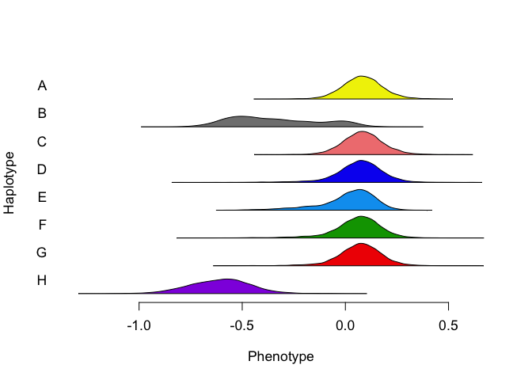<!-- -->

    ## [1] "3 9 RVBD_0491 list(RVBD_0491 = list(series = \"0,0,0,0,0,0,0,1\", probability = 0.1017))"

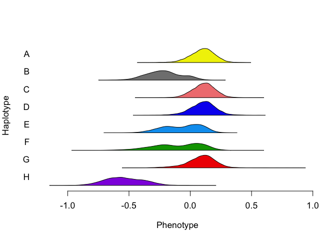<!-- -->

    ## [1] "3 9 RVBD_0863 list(RVBD_0863 = list(series = \"0,0,0,0,0,0,0,0\", probability = 0.1721))"

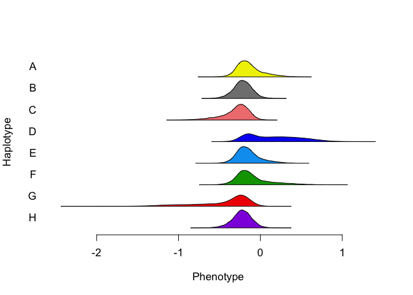<!-- -->

    ## [1] "3 9 RVBD_0961 list(RVBD_0961 = list(series = \"0,0,0,0,0,0,0,0\", probability = 0.3301))"

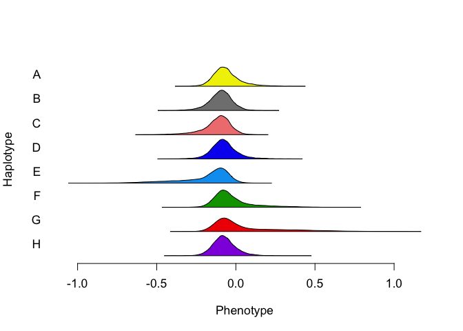<!-- -->

    ## [1] "3 9 RVBD_1405c list(RVBD_1405c = list(series = \"0,1,0,0,0,0,0,1\", probability = 0.2474))"

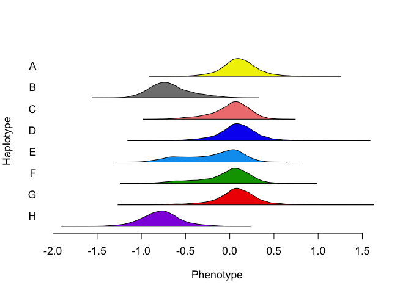<!-- -->

    ## [1] "3 9 RVBD_2257c list(RVBD_2257c = list(series = \"0,1,0,0,1,0,0,0\", probability = 0.1408))"

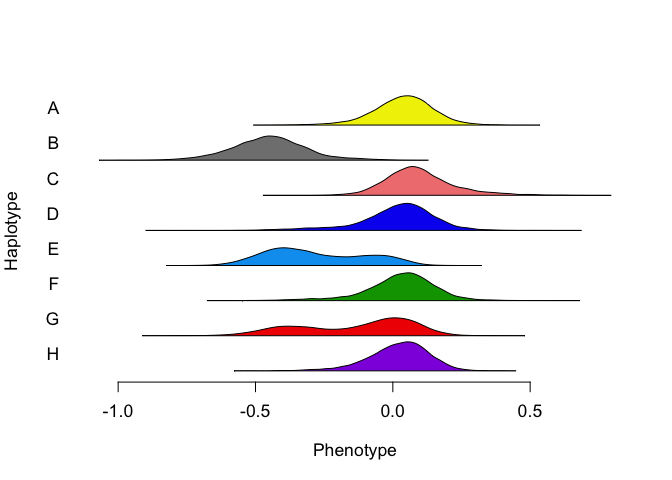<!-- -->

    ## [1] "3 9 RVBD_2306A list(RVBD_2306A = list(series = \"0,0,0,0,0,1,0,0\", probability = 0.3595))"

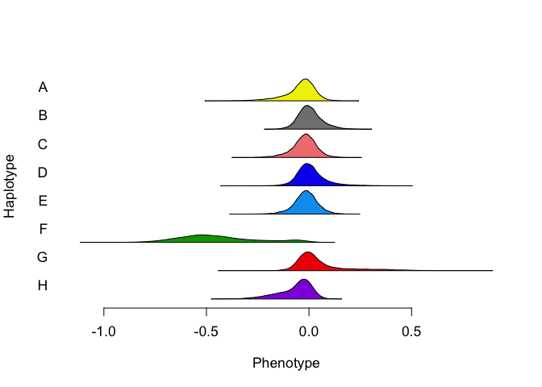<!-- -->

    ## [1] "3 9 RVBD_3050c list(RVBD_3050c = list(series = \"0,0,0,1,0,1,0,0\", probability = 0.2881))"

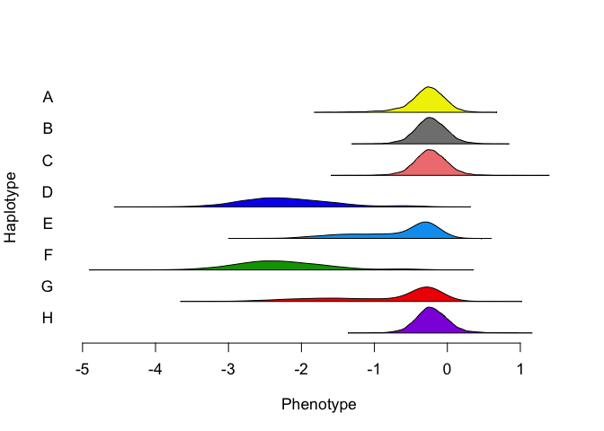<!-- -->

    ## [1] "3 9 RVBD_3813c list(RVBD_3813c = list(series = \"0,0,1,1,0,0,0,1\", probability = 0.108))"

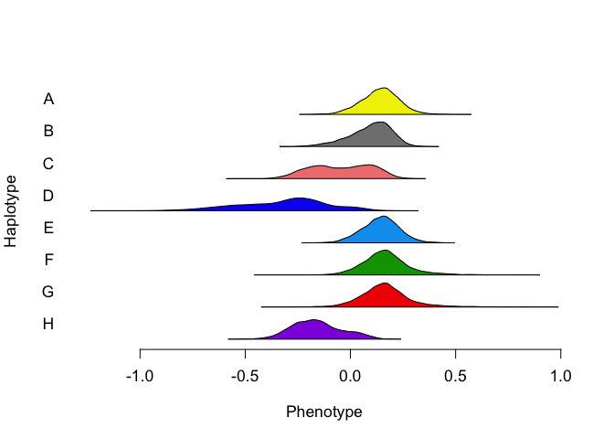<!-- -->

    ## [1] "3 9 RVBD_3881c list(RVBD_3881c = list(series = \"0,0,1,0,0,0,0,1\", probability = 0.2484))"

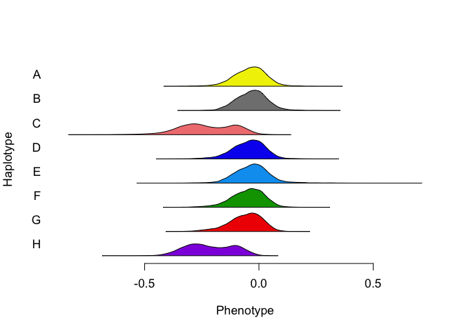<!-- -->

    ## [1] "4 10 RVBD_0158 list(RVBD_0158 = list(series = \"0,0,0,0,1,0,0,0\", probability = 0.3725))"

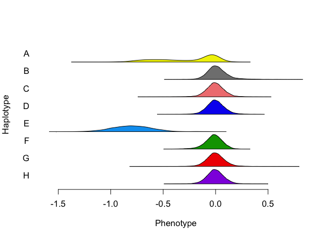<!-- -->

    ## [1] "4 10 RVBD_0437c list(RVBD_0437c = list(series = \"0,0,0,0,1,0,0,0\", probability = 0.501))"

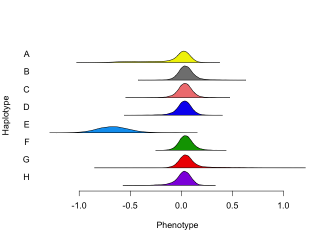<!-- -->

    ## [1] "4 10 RVBD_0490 list(RVBD_0490 = list(series = \"0,0,0,1,0,0,0,0\", probability = 0.3183))"

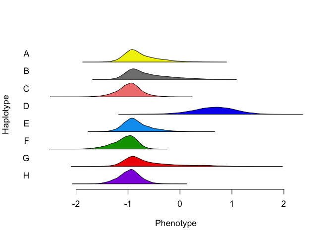<!-- -->

    ## [1] "4 10 RVBD_1051c list(RVBD_1051c = list(series = \"0,0,0,1,0,0,0,0\", probability = 0.2183))"

<!-- -->

    ## [1] "4 10 RVBD_1493 list(RVBD_1493 = list(series = \"0,0,0,0,0,0,1,0\", probability = 0.5663))"

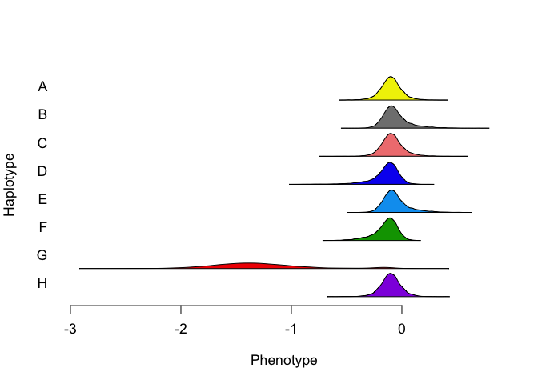<!-- -->

    ## [1] "4 10 RVBD_1692 list(RVBD_1692 = list(series = \"0,0,0,0,0,0,0,0\", probability = 0.2751))"

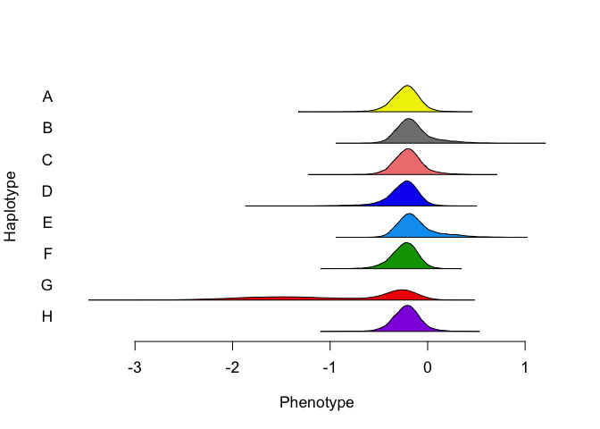<!-- -->

    ## [1] "4 10 RVBD_2643A list(RVBD_2643A = list(series = \"0,0,0,0,1,0,0,0\", probability = 0.114))"

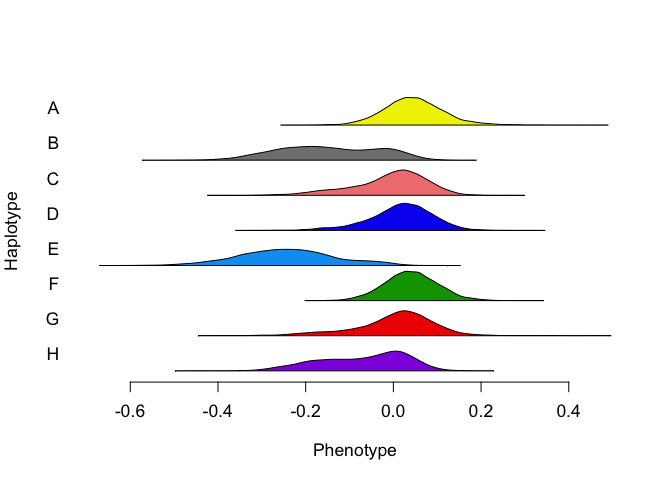<!-- -->

    ## [1] "4 10 RVBD_2854 list(RVBD_2854 = list(series = \"0,0,0,0,0,0,1,0\", probability = 0.6451))"

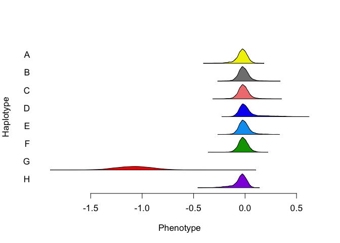<!-- -->

    ## [1] "4 10 RVBD_3261 list(RVBD_3261 = list(series = \"0,0,0,0,1,0,0,0\", probability = 0.6531))"

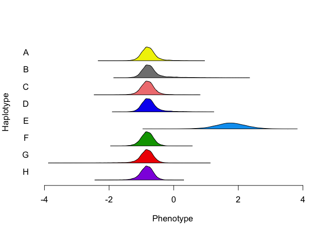<!-- -->

    ## [1] "4 10 RVBD_3262 list(RVBD_3262 = list(series = \"0,0,0,0,1,0,0,0\", probability = 0.3769))"

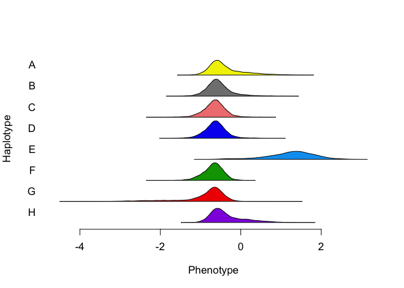<!-- -->

    ## [1] "4 10 RVBD_3452 list(RVBD_3452 = list(series = \"0,1,1,1,2,1,1,2\", probability = 0.0949))"

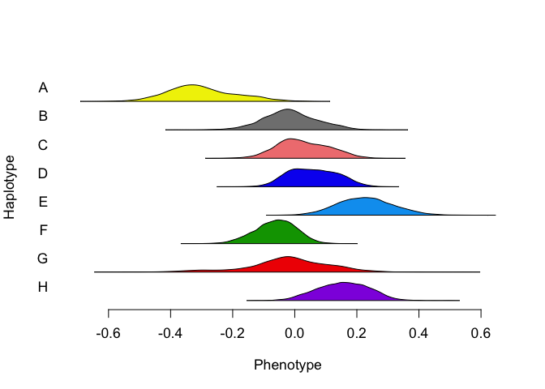<!-- -->

    ## [1] "5 11 RVBD_1103c list(RVBD_1103c = list(series = \"0,0,0,1,0,0,0,1\", probability = 0.1459))"

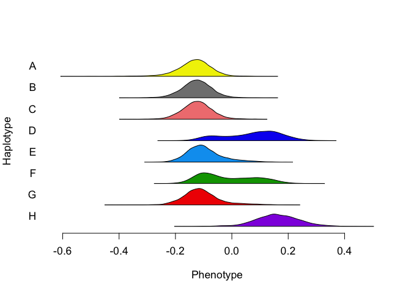<!-- -->

    ## [1] "5 11 RVBD_2267c list(RVBD_2267c = list(series = \"0,1,2,1,1,1,1,1\", probability = 0.2302))"

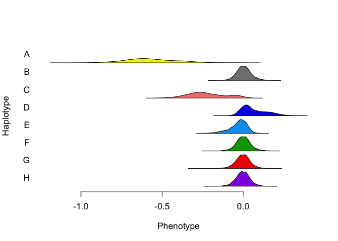<!-- -->

    ## [1] "5 11 RVBD_3658c list(RVBD_3658c = list(series = \"0,1,0,1,1,1,0,1\", probability = 0.1945))"

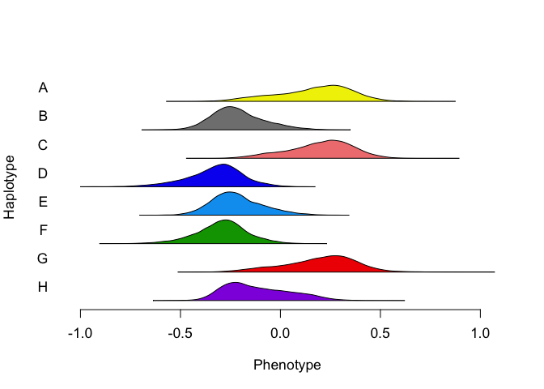<!-- -->

    ## [1] "6 11 RVBD_0806c list(RVBD_0806c = list(series = \"0,0,1,1,0,1,0,1\", probability = 0.2016))"

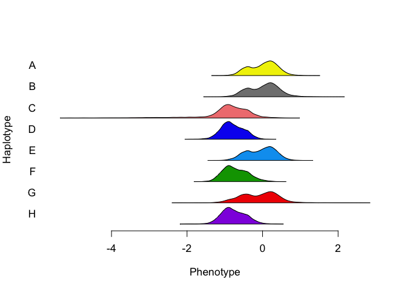<!-- -->

    ## [1] "6 11 RVBD_1782 list(RVBD_1782 = list(series = \"0,0,1,0,0,0,0,0\", probability = 0.3823))"

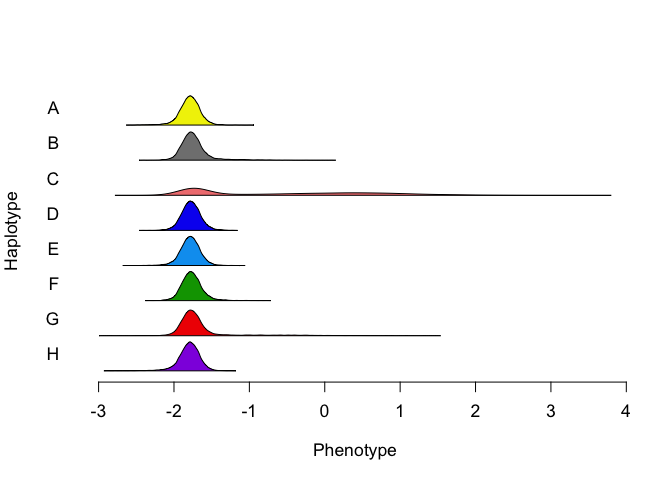<!-- -->

    ## [1] "6 11 RVBD_2281 list(RVBD_2281 = list(series = \"0,0,1,0,0,0,0,1\", probability = 0.2244))"

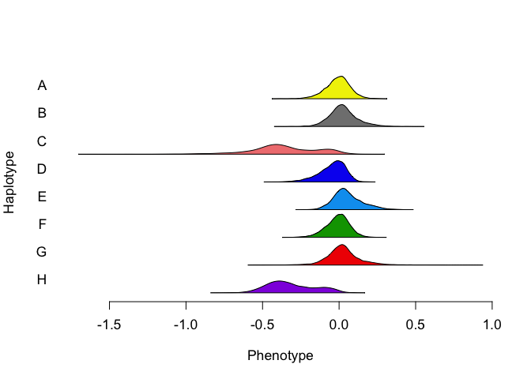<!-- -->

    ## [1] "7 13 RVBD_0740 list(RVBD_0740 = list(series = \"0,1,1,0,1,0,1,0\", probability = 0.3166))"

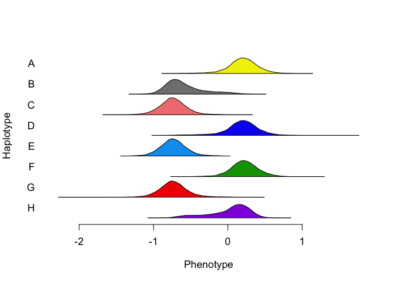<!-- -->

    ## [1] "7 13 RVBD_1405c list(RVBD_1405c = list(series = \"0,1,1,1,0,1,1,1\", probability = 0.2396))"

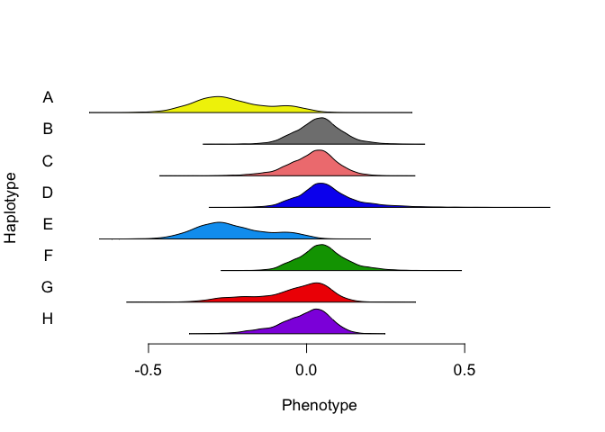<!-- -->

    ## [1] "7 13 RVBD_1793 list(RVBD_1793 = list(series = \"0,1,1,0,1,0,1,1\", probability = 0.3498))"

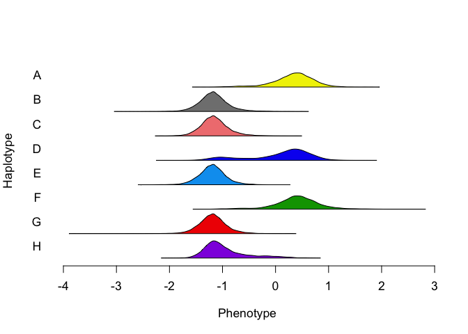<!-- -->

    ## [1] "7 13 RVBD_1821 list(RVBD_1821 = list(series = \"0,0,1,0,0,0,0,0\", probability = 0.4276))"

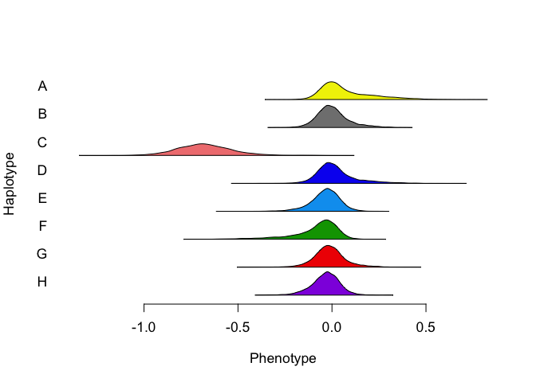<!-- -->

    ## [1] "7 13 RVBD_2039c list(RVBD_2039c = list(series = \"0,0,0,1,0,0,0,0\", probability = 0.167))"

<!-- -->

    ## [1] "7 13 RVBD_2499c list(RVBD_2499c = list(series = \"0,0,1,1,1,1,1,1\", probability = 0.2194))"

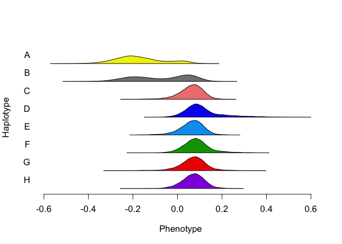<!-- -->

    ## [1] "7 13 RVBD_2515c list(RVBD_2515c = list(series = \"0,0,0,0,1,0,1,0\", probability = 0.0762))"

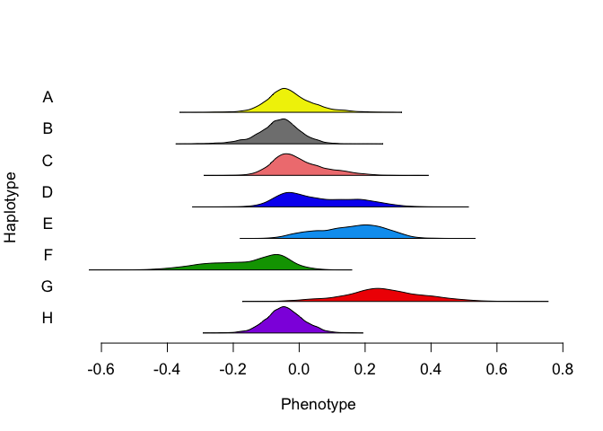<!-- -->

    ## [1] "7 13 RVBD_3516 list(RVBD_3516 = list(series = \"0,0,0,1,0,0,0,0\", probability = 0.8822))"

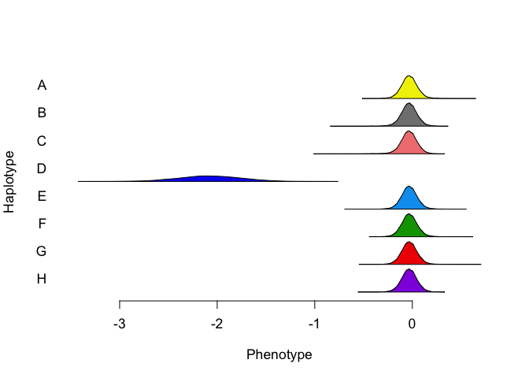<!-- -->

    ## [1] "8 14 RVBD_0114 list(RVBD_0114 = list(series = \"0,0,1,1,1,1,1,0\", probability = 0.3475))"

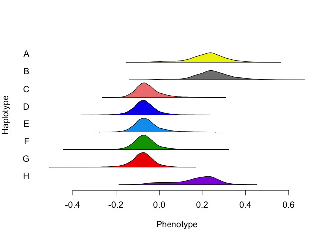<!-- -->

    ## [1] "8 14 RVBD_0590A list(RVBD_0590A = list(series = \"0,0,1,1,0,0,1,1\", probability = 0.2113))"

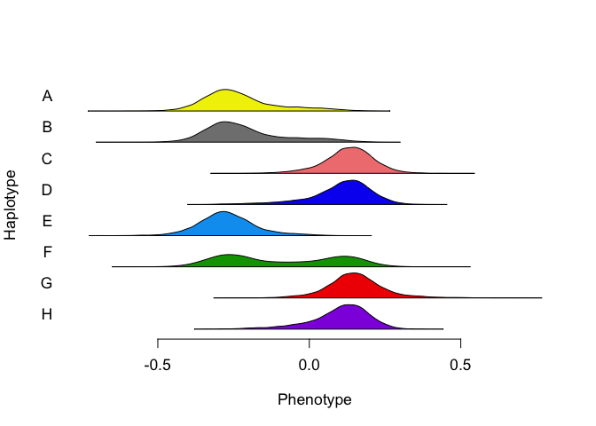<!-- -->

    ## [1] "8 14 RVBD_1486c list(RVBD_1486c = list(series = \"0,0,1,1,0,1,0,1\", probability = 0.1761))"

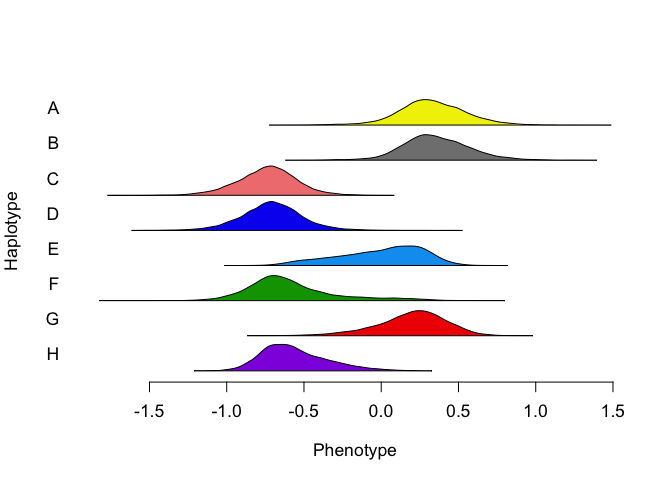<!-- -->

    ## [1] "8 14 RVBD_2284 list(RVBD_2284 = list(series = \"0,0,1,0,0,1,1,0\", probability = 0.4238))"

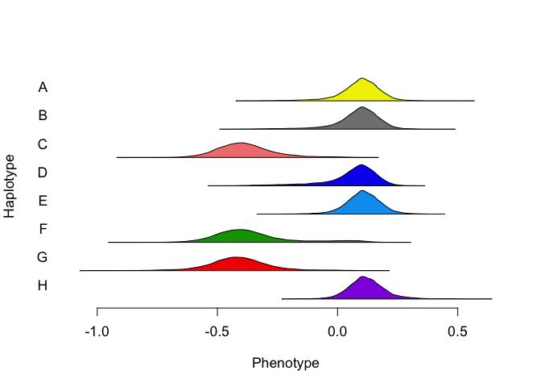<!-- -->

    ## [1] "8 14 RVBD_2499c list(RVBD_2499c = list(series = \"0,0,1,0,0,0,0,0\", probability = 0.0645))"

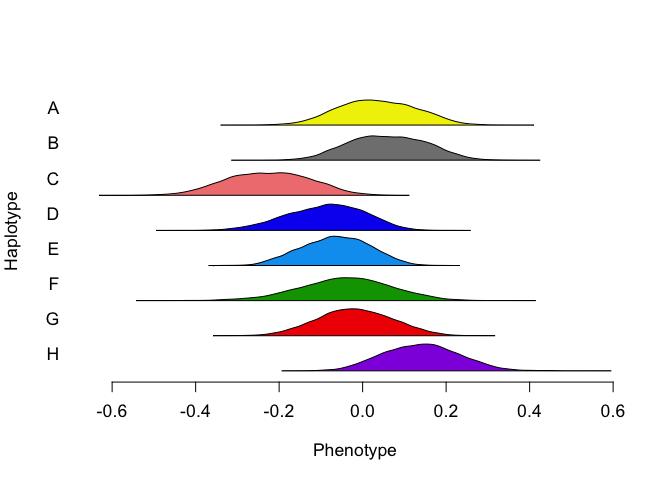<!-- -->

    ## [1] "8 14 RVBD_3369 list(RVBD_3369 = list(series = \"0,0,0,0,0,0,1,0\", probability = 0.4655))"

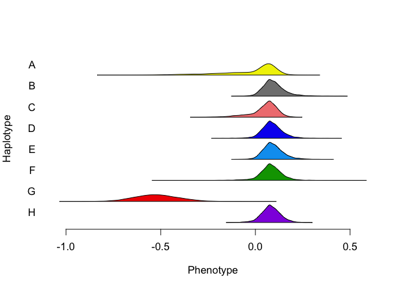<!-- -->

    ## [1] "9 18 RVBD_0492c list(RVBD_0492c = list(series = \"0,1,1,1,1,1,1,1\", probability = 0.066))"

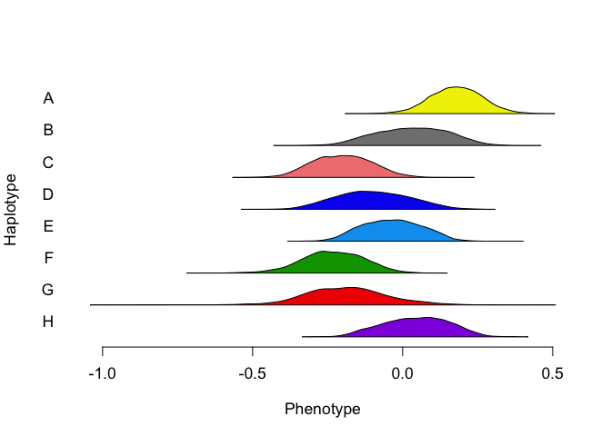<!-- -->

    ## [1] "9 18 RVBD_0746 list(RVBD_0746 = list(series = \"0,0,0,0,0,1,0,0\", probability = 0.5262))"

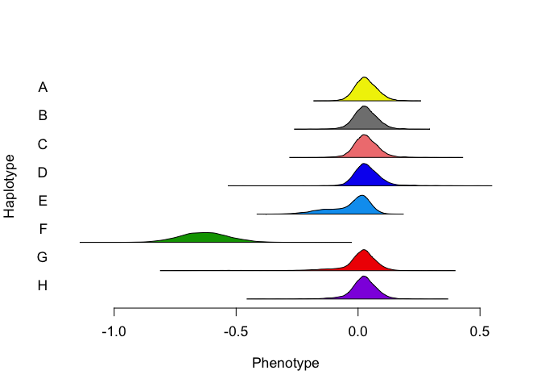<!-- -->

    ## [1] "9 18 RVBD_0971c list(RVBD_0971c = list(series = \"0,0,0,0,0,1,1,0\", probability = 0.4842))"

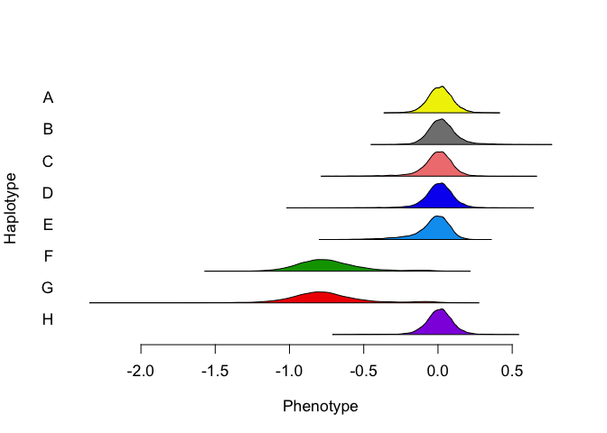<!-- -->

    ## [1] "9 18 RVBD_1705c list(RVBD_1705c = list(series = \"0,0,0,0,0,1,1,0\", probability = 0.4741))"

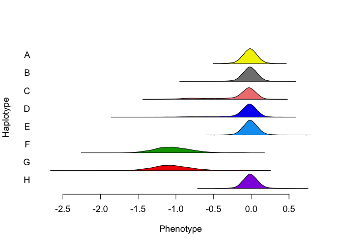<!-- -->

    ## [1] "9 18 RVBD_2161c list(RVBD_2161c = list(series = \"0,0,0,0,0,1,1,0\", probability = 0.5739))"

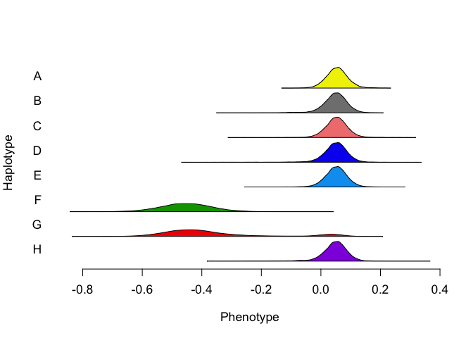<!-- -->

    ## [1] "9 18 RVBD_2318 list(RVBD_2318 = list(series = \"0,0,0,0,1,0,0,0\", probability = 0.2708))"

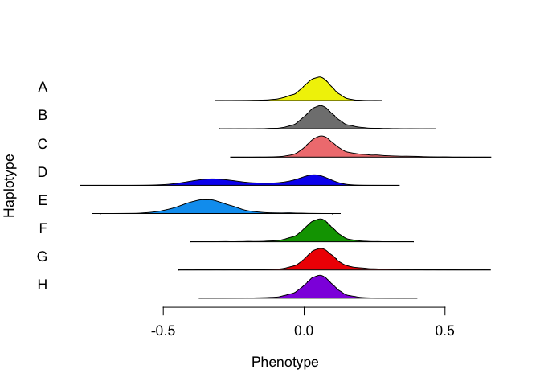<!-- -->

    ## [1] "9 18 RVBD_2372c list(RVBD_2372c = list(series = \"0,0,0,0,0,1,0,0\", probability = 0.6527))"

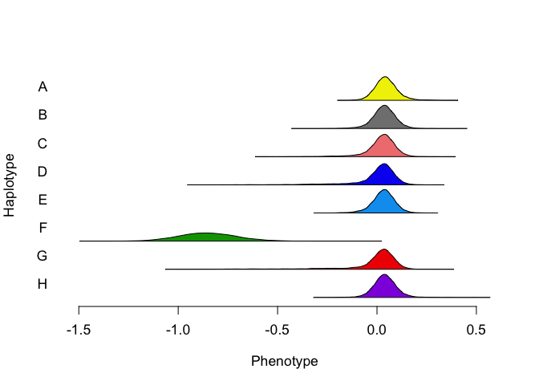<!-- -->

    ## [1] "9 18 RVBD_2490c list(RVBD_2490c = list(series = \"0,0,0,0,0,1,1,0\", probability = 0.2619))"

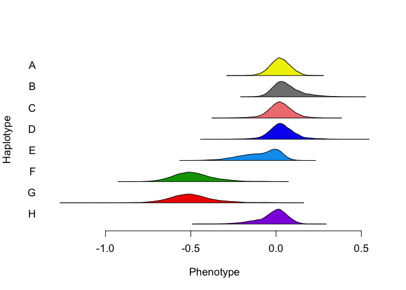<!-- -->

    ## [1] "9 18 RVBD_2949c list(RVBD_2949c = list(series = \"0,1,0,0,0,0,0,1\", probability = 0.2354))"

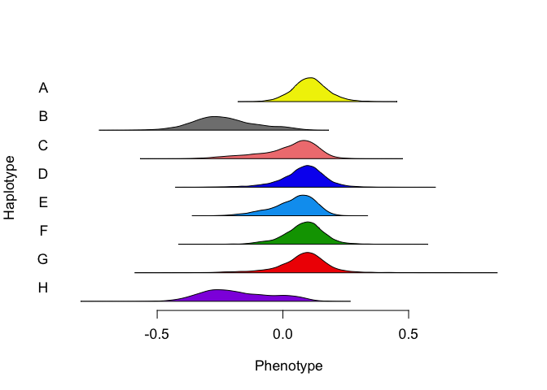<!-- -->

    ## [1] "9 18 RVBD_2952 list(RVBD_2952 = list(series = \"0,0,0,1,0,1,0,0\", probability = 0.213))"

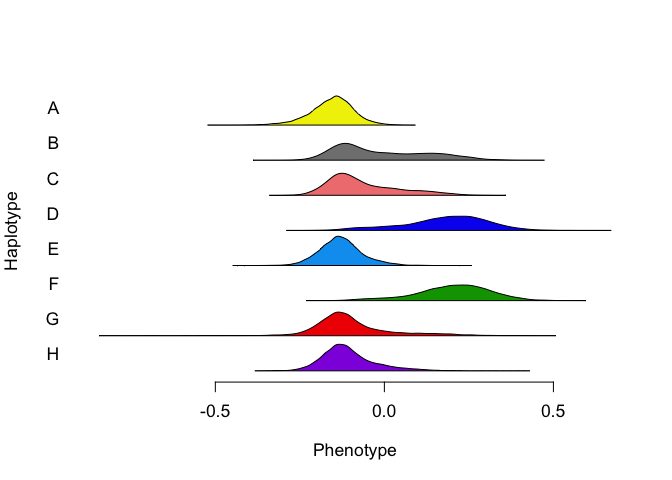<!-- -->

    ## [1] "9 18 RVBD_3590c list(RVBD_3590c = list(series = \"0,0,0,0,0,1,1,0\", probability = 0.6815))"

<!-- -->

    ## [1] "9 18 RVBD_3653 list(RVBD_3653 = list(series = \"0,0,0,0,0,1,0,0\", probability = 0.5678))"

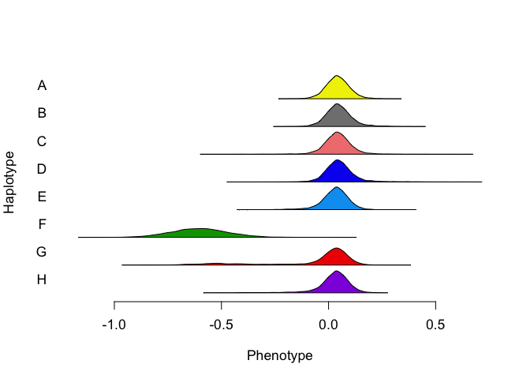<!-- -->

    ## [1] "9 18 RVBD_3848 list(RVBD_3848 = list(series = \"0,1,0,0,1,1,1,0\", probability = 0.1776))"

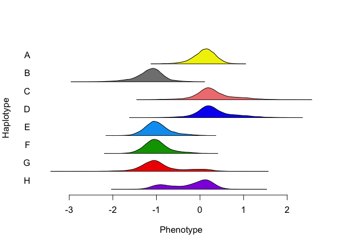<!-- -->

    ## [1] "10 X RVBD_0120c list(RVBD_0120c = list(series = \"0,1,1,1,0,0,0,0\", probability = 0.1232))"

<!-- -->

    ## [1] "10 X RVBD_0501 list(RVBD_0501 = list(series = \"0,0,0,0,0,0,1,0\", probability = 0.1183))"

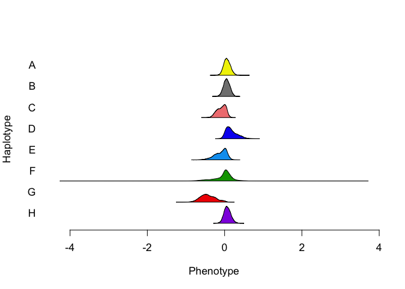<!-- -->

    ## [1] "10 X RVBD_0502 list(RVBD_0502 = list(series = \"0,0,0,0,0,1,1,0\", probability = 0.3994))"

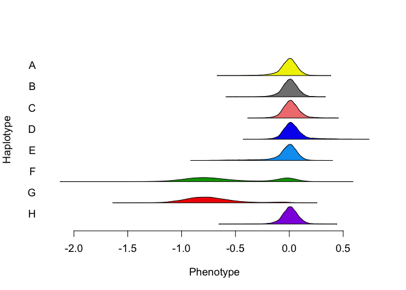<!-- -->

    ## [1] "10 X RVBD_1677 list(RVBD_1677 = list(series = \"0,0,0,1,1,0,1,0\", probability = 0.043))"

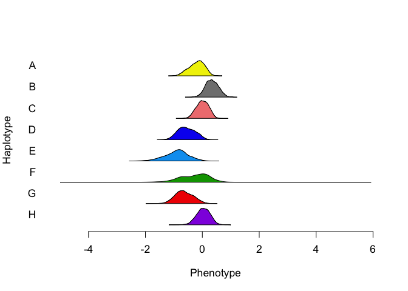<!-- -->

    ## [1] "10 X RVBD_1850 list(RVBD_1850 = list(series = \"0,0,0,0,0,0,0,0\", probability = 0.4063))"

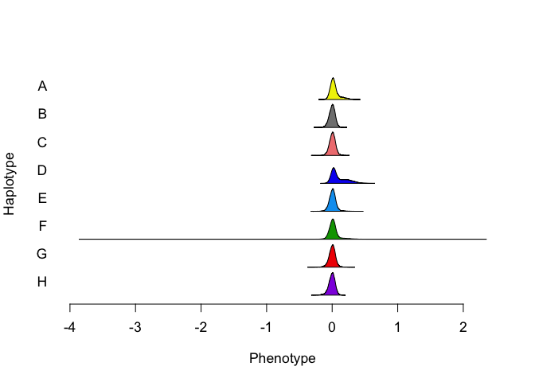<!-- -->

``` r
readr::write_csv(annots %>% tidyr::unnest(allele_series), path = "../data/suggestive-tnseq-neto-traits-annotated-10-hotspots.csv")
```

## Use the other prior for allelic series

``` r
##### From GK example code
# Specify allelic series prior
# Suggested by Wes
# Influences how much prior weight it places on more or less complicated allelic series
prior_M <- list(model.type = "crp", # crp - Chinese Restaurant Process
                prior.alpha.type = "gamma",
                prior.alpha.shape = 2.3009322,
                prior.alpha.rate = 0.7488104)
```

``` r
outfn <- "../data/suggestive-timbr-tnseq-prior2.rds"
# ensure that inputs to call_timbr all have subjects in same order!
subject_ids <- rownames(traits)
##
indices_gp <- match(subject_ids, rownames(probs))
gp <- probs[indices_gp, , ]
##
if (!file.exists(outfn)){
  timbr_out <- parallel::mclapply(neto_list, 
  #timbr_out <- lapply(neto_small, 
                                  FUN = qtl2effects::call_timbr, 
                                  mc.cores = parallel::detectCores(),
                                  traits_df = traits,
                                  prior_M = prior_M, 
                                  genoprobs_array = gp,
                                  addcovar = NULL
                                  )
  saveRDS(timbr_out, outfn)
} else {
  timbr_out <- readRDS(outfn)
}
names(timbr_out) <- trait_ann$trait
```

``` r
annots <- hs_ann %>%
  dplyr::mutate(allele_series = purrr::map(timbr_out, .f = function(x){
    pp <- x$p.M.given.y[1]
    return(tibble::tibble(series = names(pp), 
                   probability = pp
                   )
    )
    }
    )
                )
print(annots %>% tidyr::unnest(allele_series))
```

    ## # A tibble: 69 x 5
    ##       hs chr   trait      series          probability
    ##    <dbl> <chr> <chr>      <chr>                 <dbl>
    ##  1     1 4     RVBD_0309  0,0,1,0,1,1,1,1      0.0675
    ##  2     1 4     RVBD_1204c 0,0,1,0,0,0,0,2      0.0467
    ##  3     1 4     RVBD_3127  0,1,1,0,0,2,0,1      0.0713
    ##  4     2 8     RVBD_0789c 0,1,0,0,0,1,1,1      0.0459
    ##  5     2 8     RVBD_0901  0,1,2,1,2,0,1,1      0.0227
    ##  6     2 8     RVBD_2161c 0,1,2,3,4,5,6,7      0.017 
    ##  7     2 8     RVBD_2466c 0,0,0,1,2,0,0,0      0.0409
    ##  8     2 8     RVBD_3208A 0,1,0,0,0,0,0,0      0.0238
    ##  9     2 8     RVBD_3236c 0,0,0,0,0,1,0,0      0.0352
    ## 10     2 8     RVBD_3394c 0,0,1,0,2,3,0,0      0.0243
    ## # … with 59 more rows

The annotations for each plot appear before the plot.

``` r
for (i in seq_along(timbr_out)){
  print(paste0(annots[i, ], collapse = " "))
  TIMBR::TIMBR.plot.haplotypes(timbr_out[[i]])
}
```

    ## [1] "1 4 RVBD_0309 list(RVBD_0309 = list(series = \"0,0,1,0,1,1,1,1\", probability = 0.0675))"

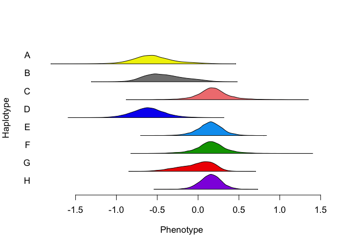<!-- -->

    ## [1] "1 4 RVBD_1204c list(RVBD_1204c = list(series = \"0,0,1,0,0,0,0,2\", probability = 0.0467))"

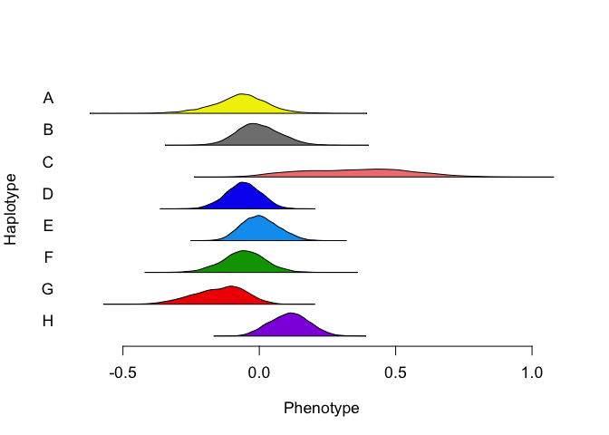<!-- -->

    ## [1] "1 4 RVBD_3127 list(RVBD_3127 = list(series = \"0,1,1,0,0,2,0,1\", probability = 0.0713))"

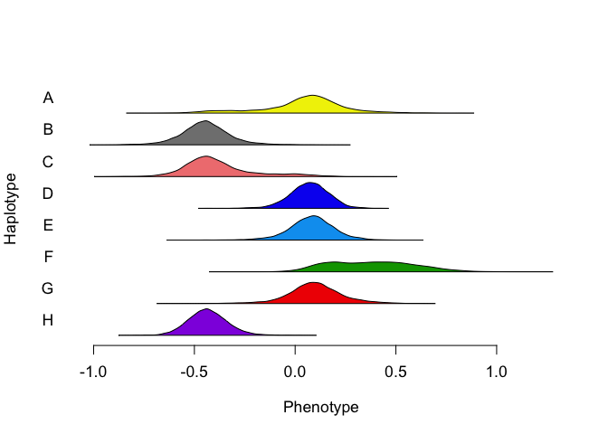<!-- -->

    ## [1] "2 8 RVBD_0789c list(RVBD_0789c = list(series = \"0,1,0,0,0,1,1,1\", probability = 0.0459))"

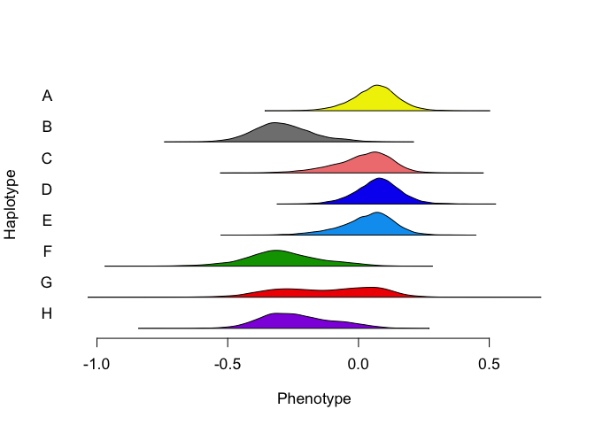<!-- -->

    ## [1] "2 8 RVBD_0901 list(RVBD_0901 = list(series = \"0,1,2,1,2,0,1,1\", probability = 0.0227))"

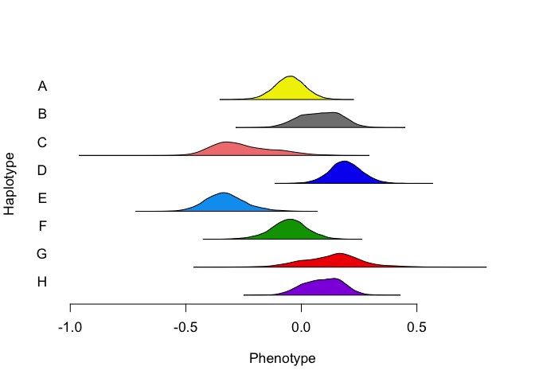<!-- -->

    ## [1] "2 8 RVBD_2161c list(RVBD_2161c = list(series = \"0,1,2,3,4,5,6,7\", probability = 0.017))"

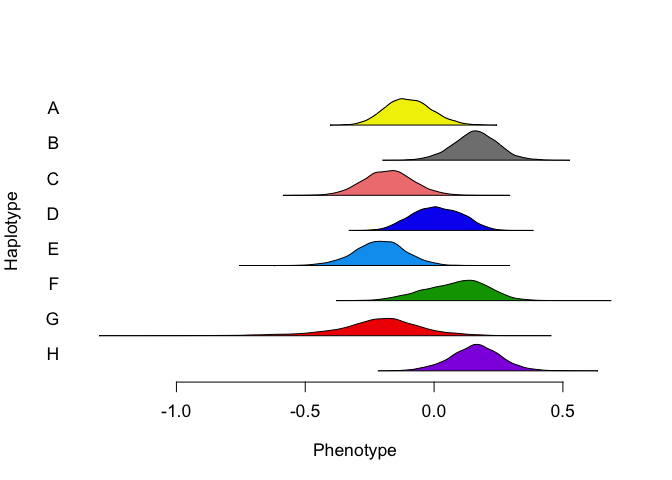<!-- -->

    ## [1] "2 8 RVBD_2466c list(RVBD_2466c = list(series = \"0,0,0,1,2,0,0,0\", probability = 0.0409))"

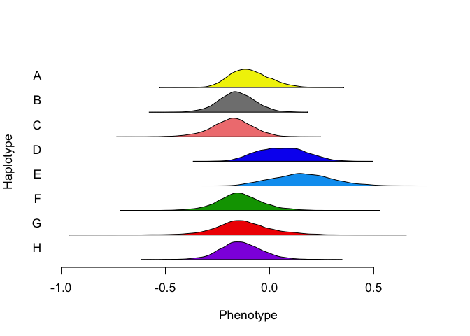<!-- -->

    ## [1] "2 8 RVBD_3208A list(RVBD_3208A = list(series = \"0,1,0,0,0,0,0,0\", probability = 0.0238))"

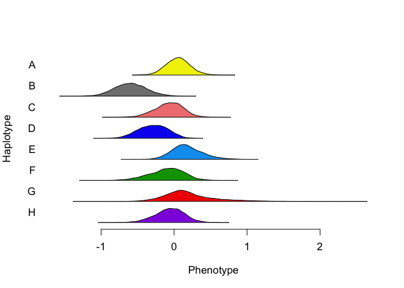<!-- -->

    ## [1] "2 8 RVBD_3236c list(RVBD_3236c = list(series = \"0,0,0,0,0,1,0,0\", probability = 0.0352))"

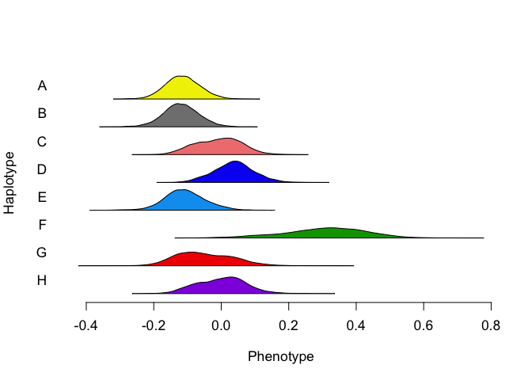<!-- -->

    ## [1] "2 8 RVBD_3394c list(RVBD_3394c = list(series = \"0,0,1,0,2,3,0,0\", probability = 0.0243))"

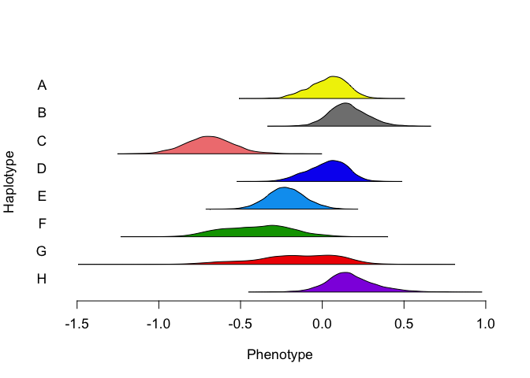<!-- -->

    ## [1] "3 9 RVBD_0490 list(RVBD_0490 = list(series = \"0,1,0,0,0,0,0,2\", probability = 0.0933))"

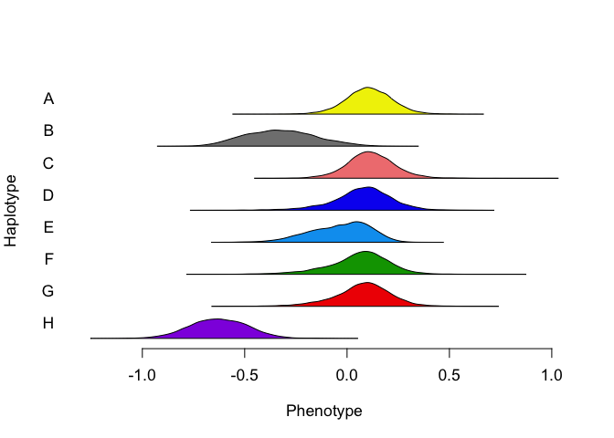<!-- -->

    ## [1] "3 9 RVBD_0491 list(RVBD_0491 = list(series = \"0,1,0,0,1,1,0,2\", probability = 0.0358))"

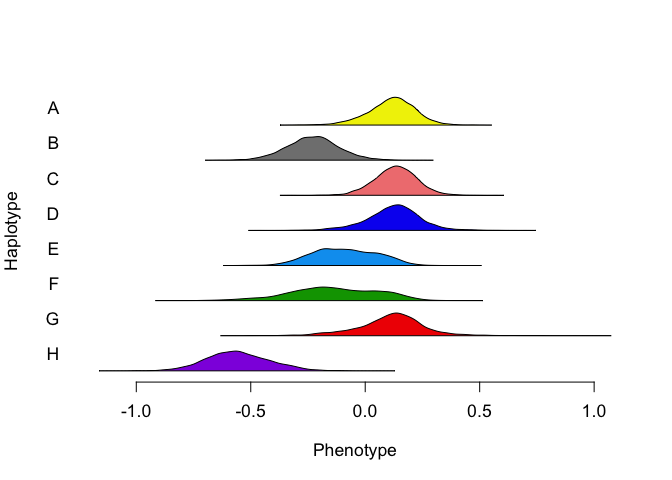<!-- -->

    ## [1] "3 9 RVBD_0863 list(RVBD_0863 = list(series = \"0,0,0,1,0,0,2,0\", probability = 0.0268))"

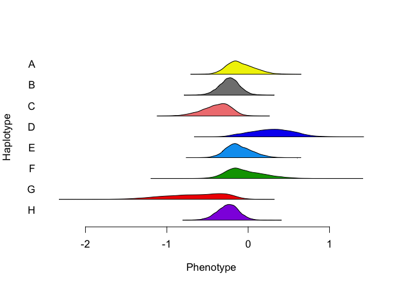<!-- -->

    ## [1] "3 9 RVBD_0961 list(RVBD_0961 = list(series = \"0,0,0,0,1,0,2,0\", probability = 0.0203))"

<!-- -->

    ## [1] "3 9 RVBD_1405c list(RVBD_1405c = list(series = \"0,1,0,0,0,0,0,1\", probability = 0.0387))"

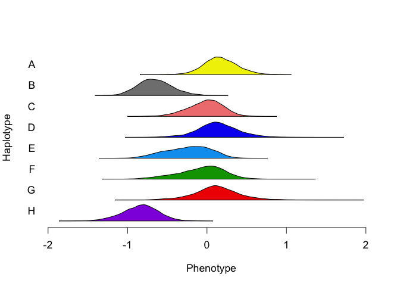<!-- -->

    ## [1] "3 9 RVBD_2257c list(RVBD_2257c = list(series = \"0,1,0,0,2,0,0,0\", probability = 0.0229))"

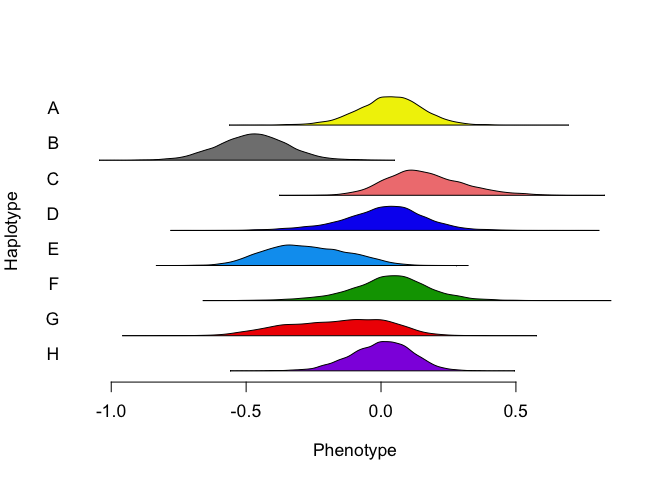<!-- -->

    ## [1] "3 9 RVBD_2306A list(RVBD_2306A = list(series = \"0,0,0,0,0,1,0,0\", probability = 0.0584))"

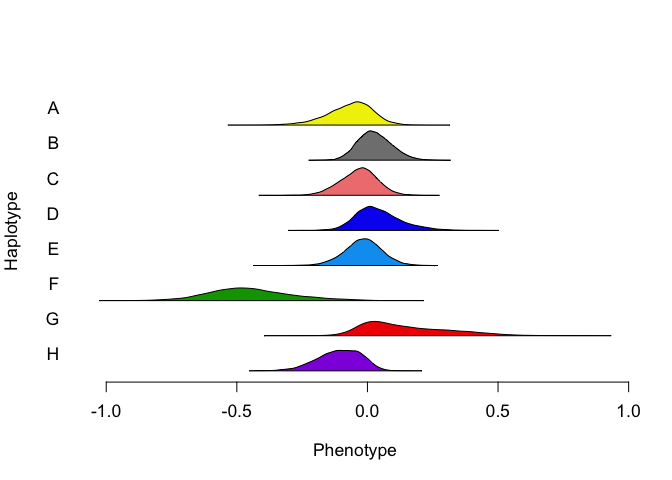<!-- -->

    ## [1] "3 9 RVBD_3050c list(RVBD_3050c = list(series = \"0,0,0,1,0,1,0,0\", probability = 0.058))"

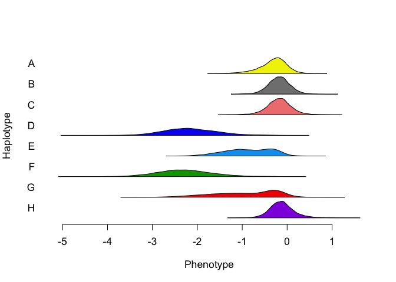<!-- -->

    ## [1] "3 9 RVBD_3813c list(RVBD_3813c = list(series = \"0,0,1,2,0,0,0,1\", probability = 0.0312))"

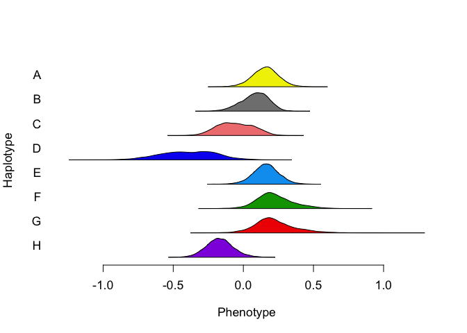<!-- -->

    ## [1] "3 9 RVBD_3881c list(RVBD_3881c = list(series = \"0,0,1,0,0,0,0,1\", probability = 0.0676))"

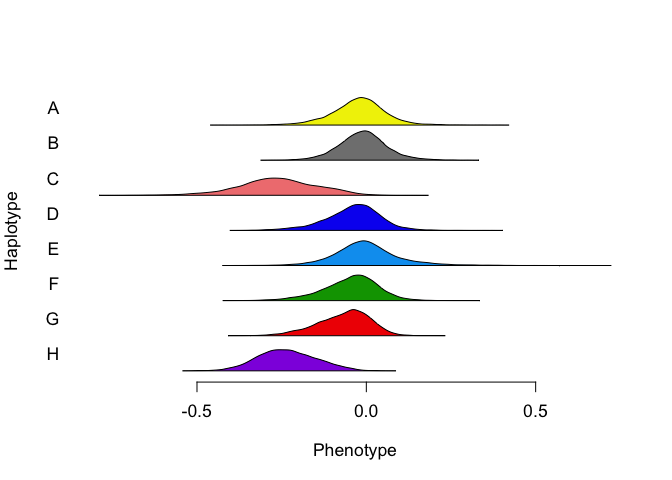<!-- -->

    ## [1] "4 10 RVBD_0158 list(RVBD_0158 = list(series = \"0,1,1,1,2,1,1,1\", probability = 0.1228))"

<!-- -->

    ## [1] "4 10 RVBD_0437c list(RVBD_0437c = list(series = \"0,0,0,0,1,0,0,0\", probability = 0.1302))"

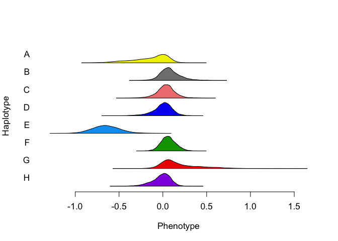<!-- -->

    ## [1] "4 10 RVBD_0490 list(RVBD_0490 = list(series = \"0,0,0,1,0,0,0,0\", probability = 0.0505))"

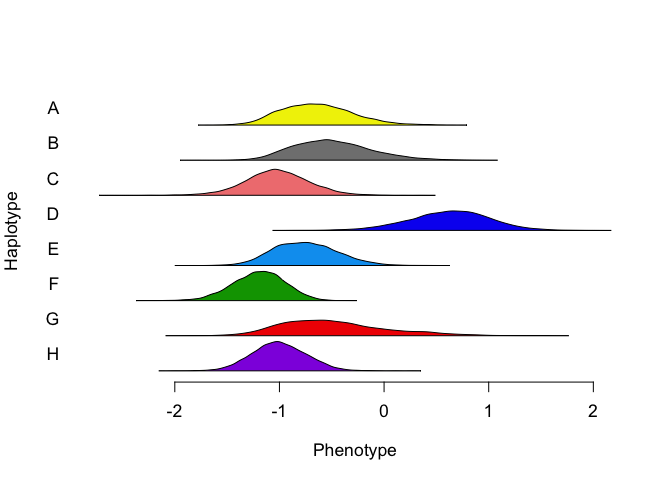<!-- -->

    ## [1] "4 10 RVBD_1051c list(RVBD_1051c = list(series = \"0,0,0,1,0,0,0,0\", probability = 0.0331))"

<!-- -->

    ## [1] "4 10 RVBD_1493 list(RVBD_1493 = list(series = \"0,0,0,0,0,0,1,0\", probability = 0.1538))"

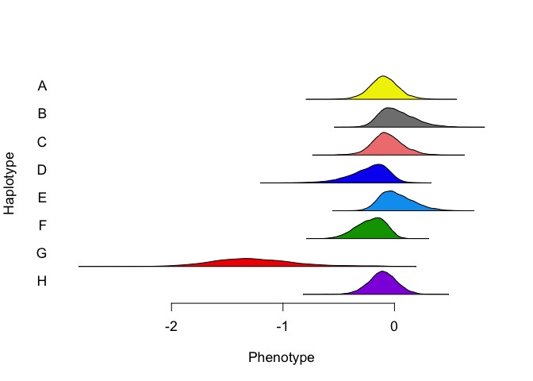<!-- -->

    ## [1] "4 10 RVBD_1692 list(RVBD_1692 = list(series = \"0,0,0,0,0,0,1,0\", probability = 0.089))"

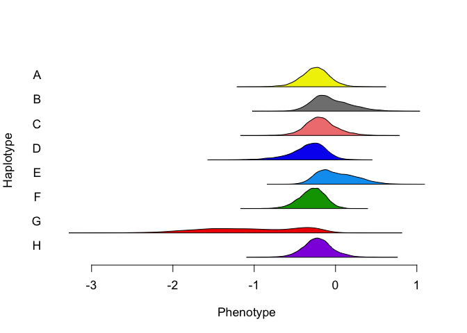<!-- -->

    ## [1] "4 10 RVBD_2643A list(RVBD_2643A = list(series = \"0,1,0,0,2,0,0,0\", probability = 0.0221))"

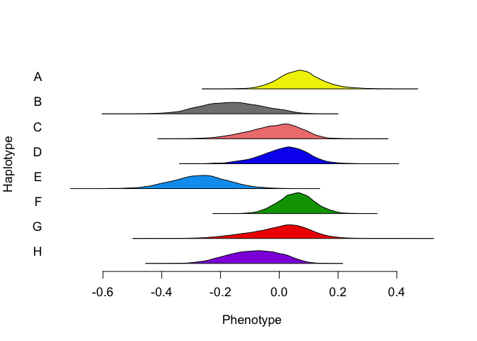<!-- -->

    ## [1] "4 10 RVBD_2854 list(RVBD_2854 = list(series = \"0,0,0,0,0,0,1,0\", probability = 0.2318))"

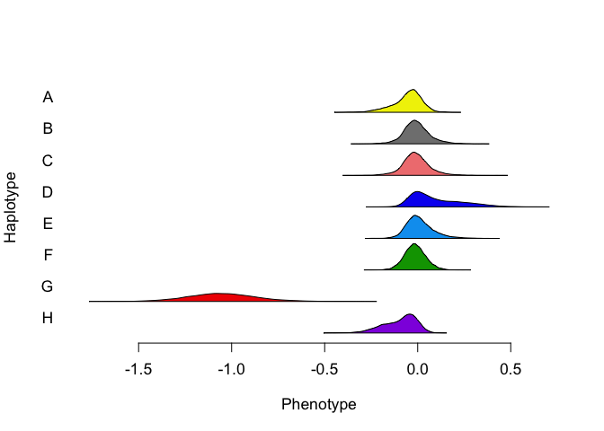<!-- -->

    ## [1] "4 10 RVBD_3261 list(RVBD_3261 = list(series = \"0,0,0,0,1,0,0,0\", probability = 0.2126))"

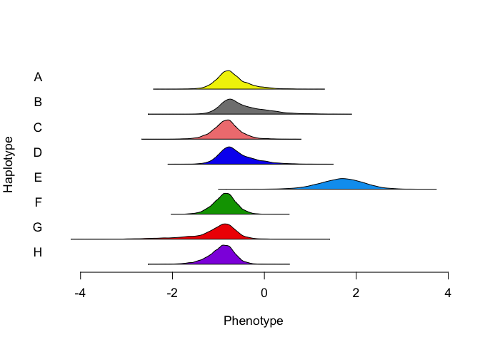<!-- -->

    ## [1] "4 10 RVBD_3262 list(RVBD_3262 = list(series = \"0,0,0,0,1,0,0,0\", probability = 0.0678))"

<!-- -->

    ## [1] "4 10 RVBD_3452 list(RVBD_3452 = list(series = \"0,1,2,3,4,5,6,7\", probability = 0.033))"

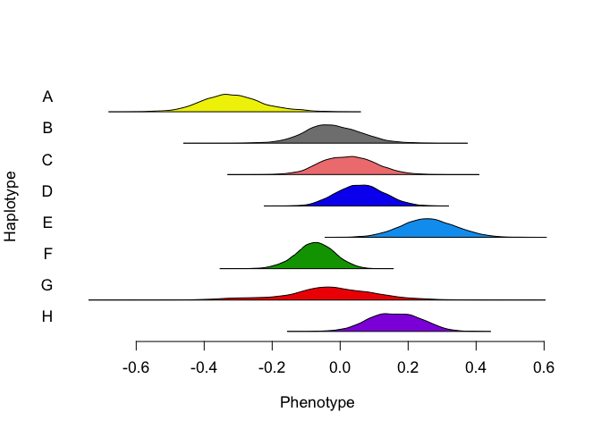<!-- -->

    ## [1] "5 11 RVBD_1103c list(RVBD_1103c = list(series = \"0,0,0,1,0,2,0,3\", probability = 0.0312))"

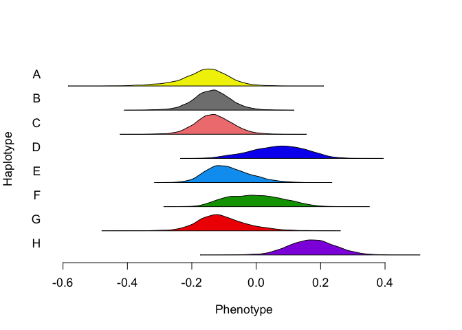<!-- -->

    ## [1] "5 11 RVBD_2267c list(RVBD_2267c = list(series = \"0,1,2,3,1,1,1,1\", probability = 0.1225))"

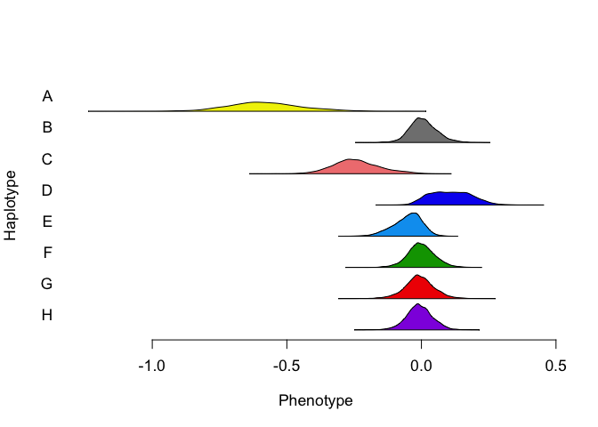<!-- -->

    ## [1] "5 11 RVBD_3658c list(RVBD_3658c = list(series = \"0,1,0,1,1,1,0,1\", probability = 0.0248))"

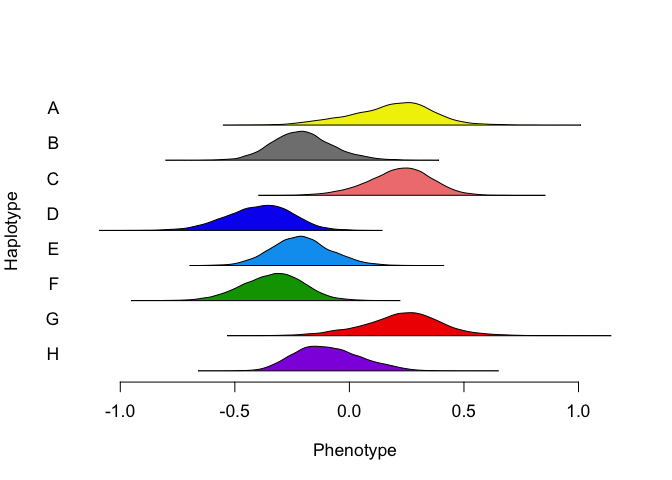<!-- -->

    ## [1] "6 11 RVBD_0806c list(RVBD_0806c = list(series = \"0,0,1,1,0,1,0,1\", probability = 0.038))"

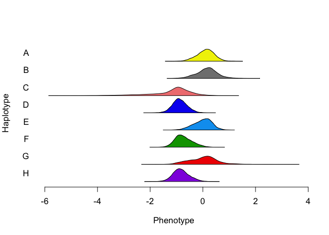<!-- -->

    ## [1] "6 11 RVBD_1782 list(RVBD_1782 = list(series = \"0,0,1,0,0,0,0,0\", probability = 0.1946))"

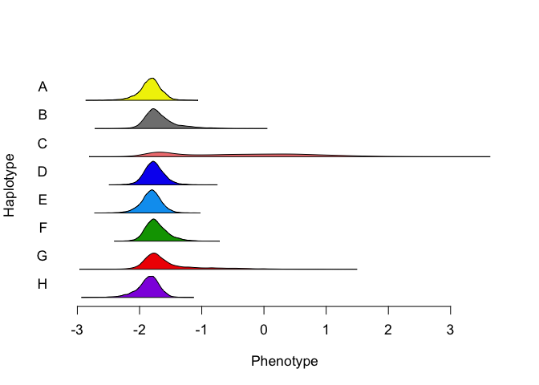<!-- -->

    ## [1] "6 11 RVBD_2281 list(RVBD_2281 = list(series = \"0,0,1,0,0,0,0,2\", probability = 0.0356))"

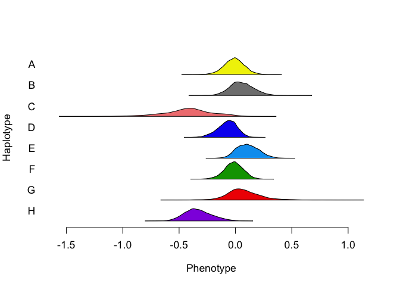<!-- -->

    ## [1] "7 13 RVBD_0740 list(RVBD_0740 = list(series = \"0,1,1,0,1,0,1,0\", probability = 0.0481))"

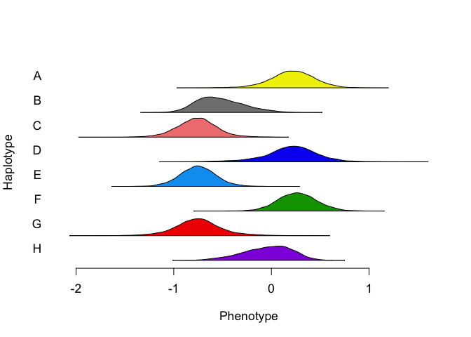<!-- -->

    ## [1] "7 13 RVBD_1405c list(RVBD_1405c = list(series = \"0,1,1,1,0,1,1,1\", probability = 0.0402))"

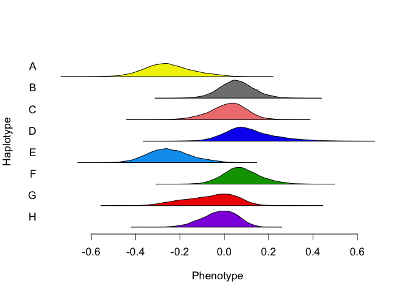<!-- -->

    ## [1] "7 13 RVBD_1793 list(RVBD_1793 = list(series = \"0,1,1,0,1,0,1,1\", probability = 0.0654))"

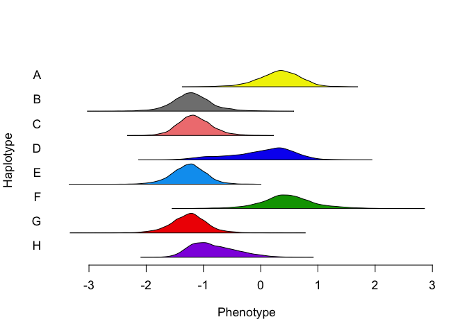<!-- -->

    ## [1] "7 13 RVBD_1821 list(RVBD_1821 = list(series = \"0,0,1,0,0,0,0,0\", probability = 0.0795))"

<!-- -->

    ## [1] "7 13 RVBD_2039c list(RVBD_2039c = list(series = \"0,0,1,2,0,0,0,0\", probability = 0.0316))"

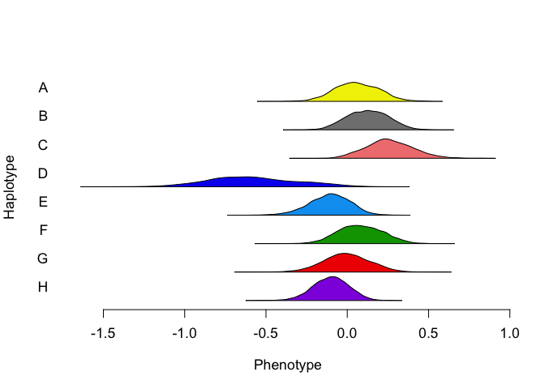<!-- -->

    ## [1] "7 13 RVBD_2499c list(RVBD_2499c = list(series = \"0,0,1,1,1,1,1,1\", probability = 0.0415))"

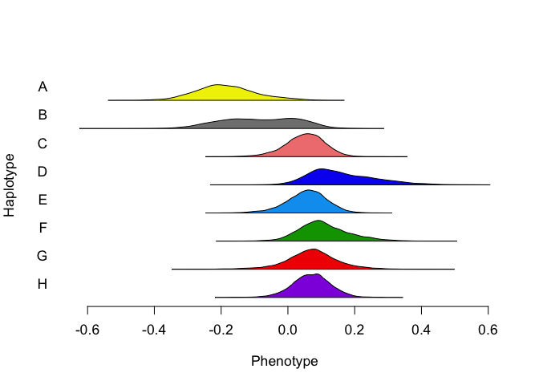<!-- -->

    ## [1] "7 13 RVBD_2515c list(RVBD_2515c = list(series = \"0,1,2,3,4,5,6,7\", probability = 0.0264))"

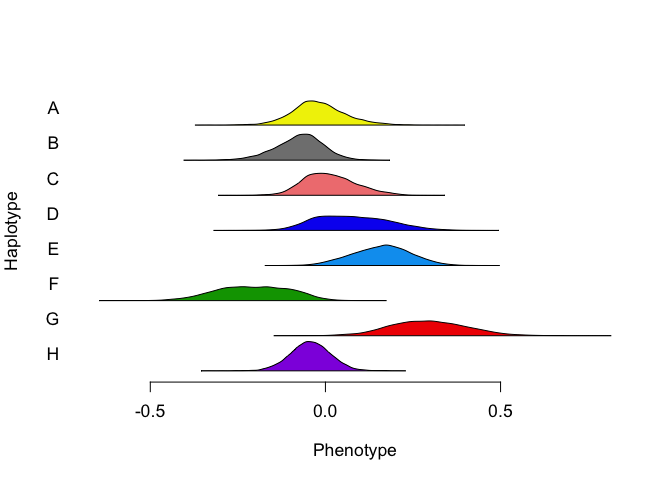<!-- -->

    ## [1] "7 13 RVBD_3516 list(RVBD_3516 = list(series = \"0,0,0,1,0,0,0,0\", probability = 0.6452))"

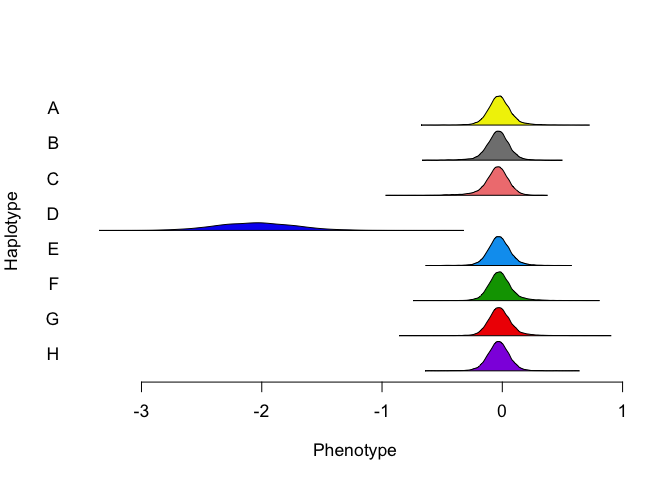<!-- -->

    ## [1] "8 14 RVBD_0114 list(RVBD_0114 = list(series = \"0,0,1,1,1,1,1,0\", probability = 0.0657))"

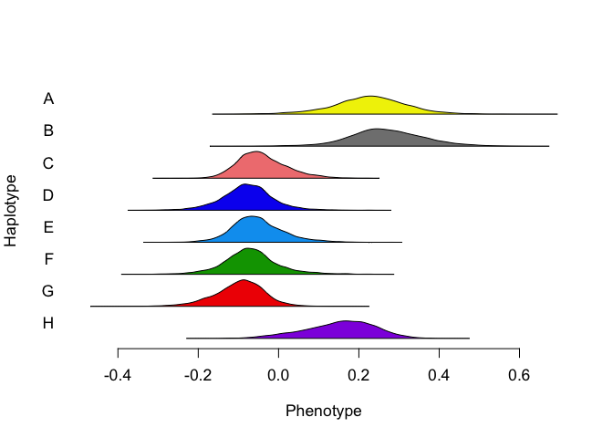<!-- -->

    ## [1] "8 14 RVBD_0590A list(RVBD_0590A = list(series = \"0,0,1,1,0,0,1,1\", probability = 0.0391))"

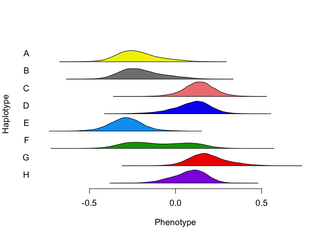<!-- -->

    ## [1] "8 14 RVBD_1486c list(RVBD_1486c = list(series = \"0,0,1,1,2,1,0,1\", probability = 0.0185))"

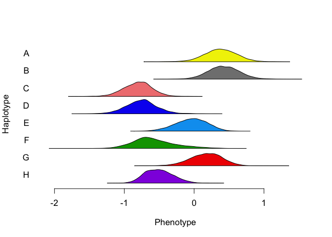<!-- -->

    ## [1] "8 14 RVBD_2284 list(RVBD_2284 = list(series = \"0,0,1,0,0,1,1,0\", probability = 0.076))"

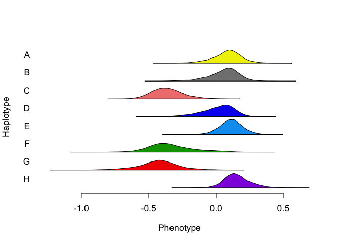<!-- -->

    ## [1] "8 14 RVBD_2499c list(RVBD_2499c = list(series = \"0,0,1,0,0,0,0,2\", probability = 0.0237))"

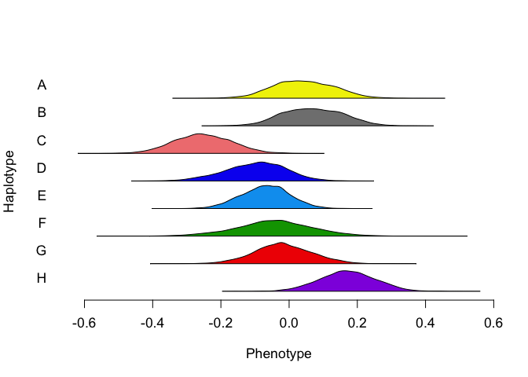<!-- -->

    ## [1] "8 14 RVBD_3369 list(RVBD_3369 = list(series = \"0,0,0,0,0,0,1,0\", probability = 0.1047))"

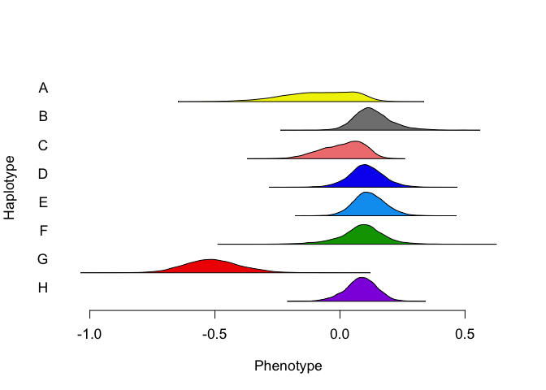<!-- -->

    ## [1] "9 18 RVBD_0492c list(RVBD_0492c = list(series = \"0,1,2,3,4,5,6,7\", probability = 0.0232))"

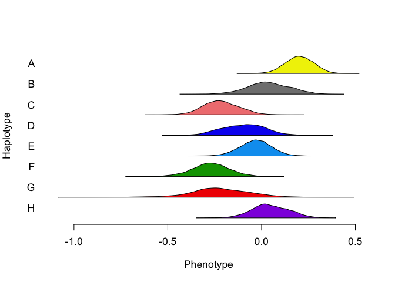<!-- -->

    ## [1] "9 18 RVBD_0746 list(RVBD_0746 = list(series = \"0,0,0,0,0,1,0,0\", probability = 0.1526))"

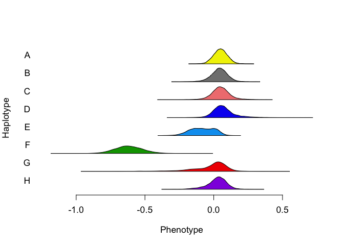<!-- -->

    ## [1] "9 18 RVBD_0971c list(RVBD_0971c = list(series = \"0,0,0,0,0,1,1,0\", probability = 0.1285))"

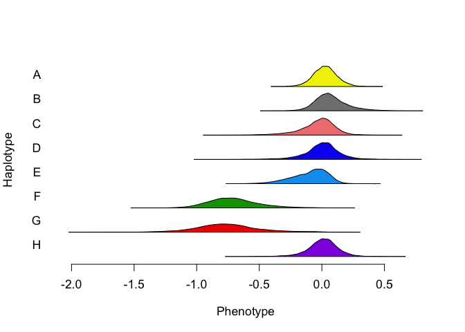<!-- -->

    ## [1] "9 18 RVBD_1705c list(RVBD_1705c = list(series = \"0,0,0,0,0,1,1,0\", probability = 0.1231))"

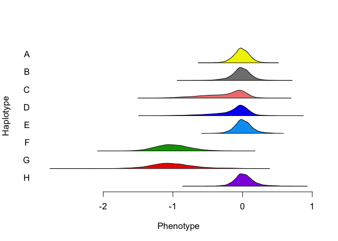<!-- -->

    ## [1] "9 18 RVBD_2161c list(RVBD_2161c = list(series = \"0,0,0,0,0,1,1,0\", probability = 0.2362))"

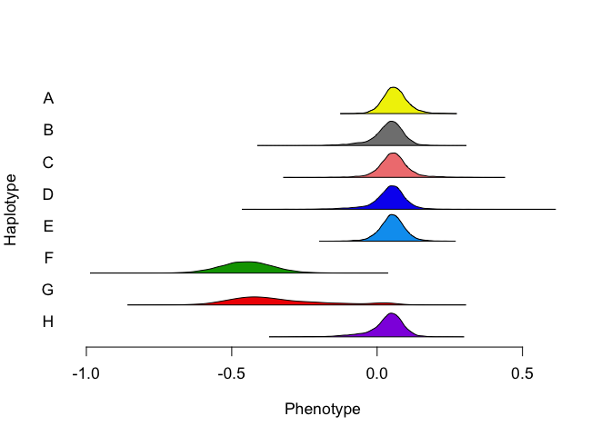<!-- -->

    ## [1] "9 18 RVBD_2318 list(RVBD_2318 = list(series = \"0,0,0,0,1,0,0,0\", probability = 0.0574))"

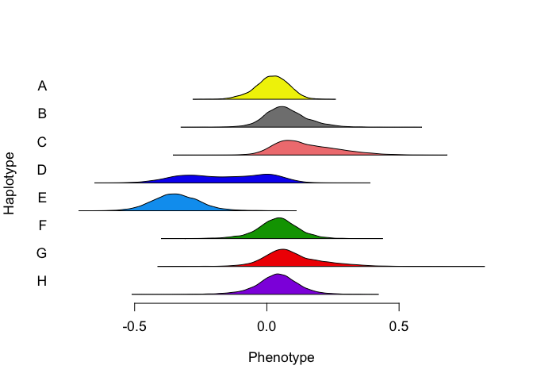<!-- -->

    ## [1] "9 18 RVBD_2372c list(RVBD_2372c = list(series = \"0,0,0,0,0,1,0,0\", probability = 0.2441))"

<!-- -->

    ## [1] "9 18 RVBD_2490c list(RVBD_2490c = list(series = \"0,0,0,0,1,2,2,0\", probability = 0.048))"

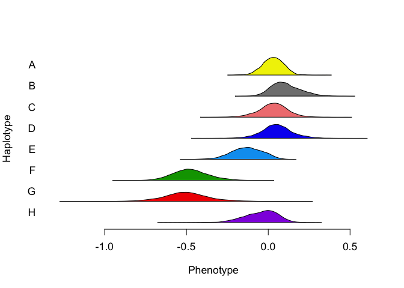<!-- -->

    ## [1] "9 18 RVBD_2949c list(RVBD_2949c = list(series = \"0,1,0,0,0,0,0,1\", probability = 0.0479))"

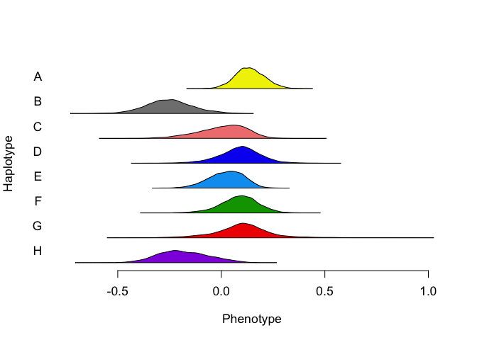<!-- -->

    ## [1] "9 18 RVBD_2952 list(RVBD_2952 = list(series = \"0,0,0,1,0,1,0,0\", probability = 0.0336))"

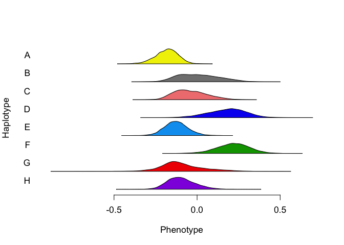<!-- -->

    ## [1] "9 18 RVBD_3590c list(RVBD_3590c = list(series = \"0,0,0,0,0,1,1,0\", probability = 0.281))"

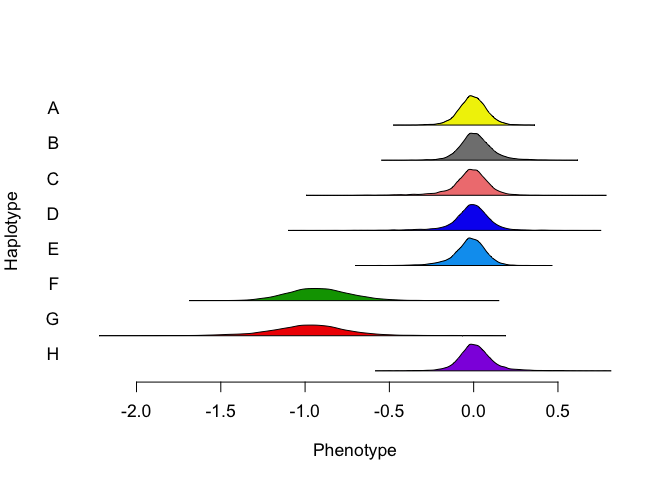<!-- -->

    ## [1] "9 18 RVBD_3653 list(RVBD_3653 = list(series = \"0,0,0,0,0,1,0,0\", probability = 0.1904))"

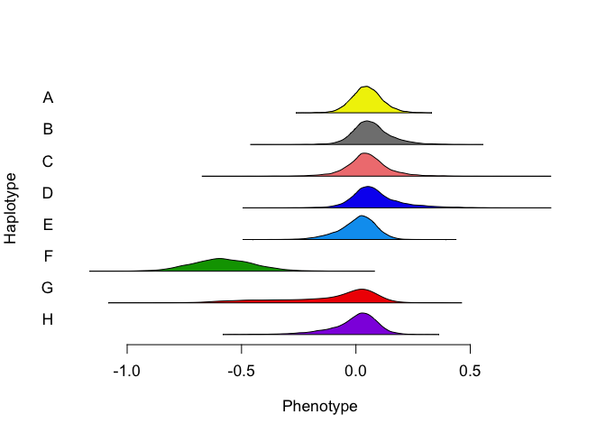<!-- -->

    ## [1] "9 18 RVBD_3848 list(RVBD_3848 = list(series = \"0,1,0,0,1,1,1,0\", probability = 0.0195))"

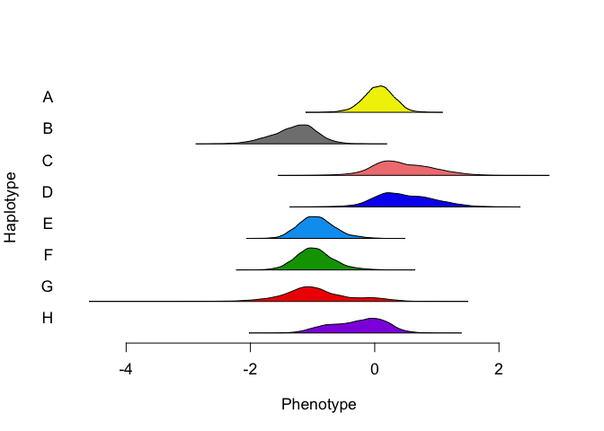<!-- -->

    ## [1] "10 X RVBD_0120c list(RVBD_0120c = list(series = \"0,1,1,1,0,0,0,0\", probability = 0.0241))"

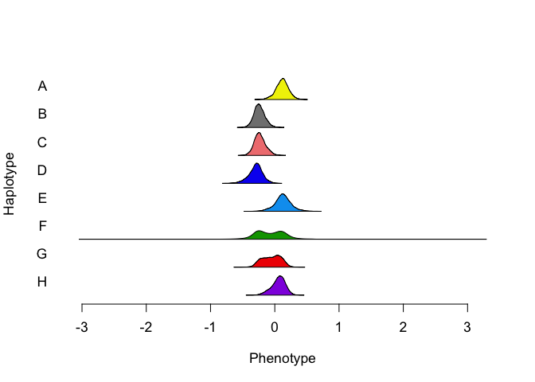<!-- -->

    ## [1] "10 X RVBD_0501 list(RVBD_0501 = list(series = \"0,1,2,3,4,5,6,7\", probability = 0.0219))"

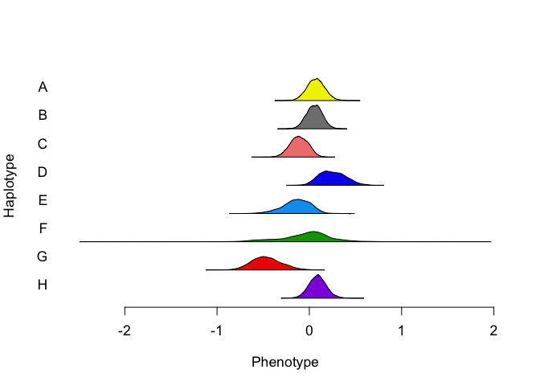<!-- -->

    ## [1] "10 X RVBD_0502 list(RVBD_0502 = list(series = \"0,0,0,0,0,1,1,0\", probability = 0.1207))"

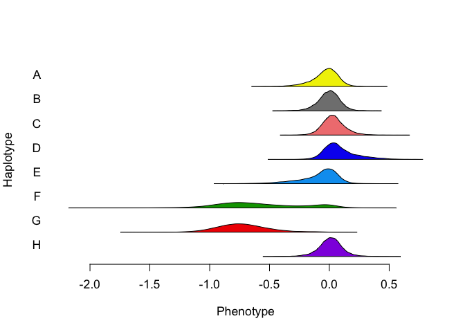<!-- -->

    ## [1] "10 X RVBD_1677 list(RVBD_1677 = list(series = \"0,1,2,3,4,5,6,7\", probability = 0.0295))"

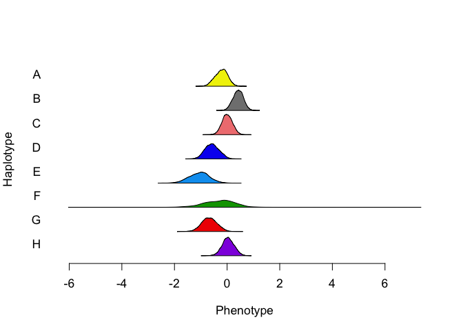<!-- -->

    ## [1] "10 X RVBD_1850 list(RVBD_1850 = list(series = \"0,0,0,1,0,0,0,0\", probability = 0.0495))"

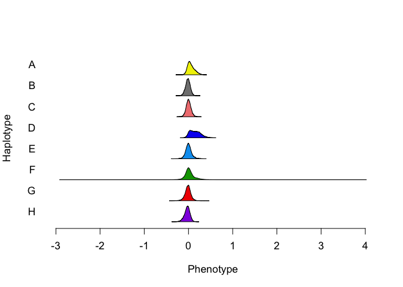<!-- -->

``` r
fn <- "../data/suggestive-tnseq-prior2.csv"
readr::write_csv(annots %>% tidyr::unnest(allele_series), path = fn)
```
