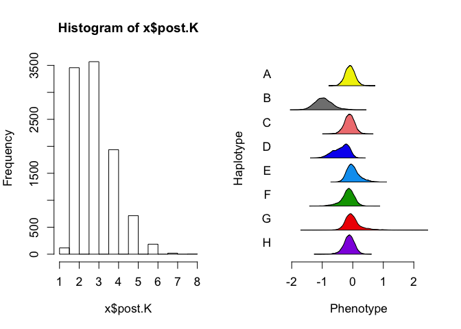

Allele effects in TnSeq Hotspots 1, 2, 3, 5, 7, 10 (small hotspots)
================
Frederick J. Boehm
11/13/2019

Last modified: 2019-11-13
    15:38:23.

``` r
library(tidyverse)
```

    ## ── Attaching packages ────────────────────────────── tidyverse 1.2.1 ──

    ## ✔ ggplot2 3.2.1     ✔ purrr   0.3.3
    ## ✔ tibble  2.1.3     ✔ dplyr   0.8.3
    ## ✔ tidyr   1.0.0     ✔ stringr 1.4.0
    ## ✔ readr   1.3.1     ✔ forcats 0.4.0

    ## ── Conflicts ───────────────────────────────── tidyverse_conflicts() ──
    ## ✖ dplyr::filter() masks stats::filter()
    ## ✖ dplyr::lag()    masks stats::lag()

``` r
hots <- c(1:3, 5, 7, 10)
```

``` r
probs <- readRDS("../data/genotypes_array.rds")
```

``` r
tt <- read.csv("../data/neto_traits_by_probe3_annotated.csv")
neto <- tt %>%
  tidyr::pivot_longer(cols = V2:V35, values_to = "trait", names_to = "trait_name") %>%
  dplyr::filter(!is.na(trait)) %>%
  dplyr::select(- trait_name, - neto.n, - row, - n.traits, - cM, -hs, - chr)
neto_plus <- tt %>%
  tidyr::pivot_longer(cols = V2:V35, values_to = "trait", names_to = "trait_name") %>%
  dplyr::filter(!is.na(trait)) %>%
  dplyr::select(- trait_name)
```

``` r
(hot_indices <- neto_plus %>%
  dplyr::group_by(hs) %>%
  dplyr::tally() %>%
  dplyr::mutate(end = cumsum(n)) %>%
  dplyr::mutate(start = 1L + end - n)
)
```

    ## # A tibble: 10 x 4
    ##       hs     n   end start
    ##    <int> <int> <int> <int>
    ##  1     1     9     9     1
    ##  2     2    15    24    10
    ##  3     3    15    39    25
    ##  4     4  1905  1944    40
    ##  5     5    20  1964  1945
    ##  6     6  1265  3229  1965
    ##  7     7     8  3237  3230
    ##  8     8    80  3317  3238
    ##  9     9    66  3383  3318
    ## 10    10     2  3385  3384

``` r
load("../data/reduced_map_qtl2_mapping_objects.Rdata")
traits <- readRDS("../data/tnseq-traits.rds")
```

``` r
out <- purrr::map(hots, .f = function(hot) knitr::knit_expand(text = readLines(here::here("Rmd", "tnseq-timbr-hotspots-small-one.Rmd"))))
```

``` r
fn <- "../data/timbr-tnseq-results-neto-hs1.rds"
timbr_out <- readRDS(fn)
```

``` r
par(mfrow=c(1,2))    # set the plotting area into a 1*2 array
purrr::map(.x = timbr_out, .f = function(x){
  hist(x$post.K)
  TIMBR::TIMBR.plot.haplotypes(x)
}
  )
```

<!-- --><!-- --><!-- --><!-- --><!-- --><!-- --><!-- --><!-- --><!-- -->

    ## [[1]]
    ## NULL
    ## 
    ## [[2]]
    ## NULL
    ## 
    ## [[3]]
    ## NULL
    ## 
    ## [[4]]
    ## NULL
    ## 
    ## [[5]]
    ## NULL
    ## 
    ## [[6]]
    ## NULL
    ## 
    ## [[7]]
    ## NULL
    ## 
    ## [[8]]
    ## NULL
    ## 
    ## [[9]]
    ## NULL

# Pull out the most probable allelic series for each TIMBR analysis

We should add to our annotations table the LOD scores for every trait -
marker pair.

``` r
t1 <- purrr::map(.x = timbr_out, 
           .f = function(x){
             foo <- x$p.M.given.y[1]
             tibble::tibble(posterior_prob = foo, 
                            allele_series = names(foo))
             }
           ) %>%
  dplyr::bind_rows()
```

``` r
start <- hot_indices %>%
  dplyr::filter(hs == 1) %>%
  dplyr::select(start) %>%
  unlist()
stop <- hot_indices %>%
  dplyr::filter(hs == 1) %>%
  dplyr::select(end) %>%
  unlist()

neto_plus %>%
  dplyr::filter(hs == 1) %>%
  dplyr::select(probe, trait) %>%
  purrr::pmap( 
           .f = function(probe, trait){
             pheno <- traits[ , colnames(traits) == trait, drop = FALSE]
             geno <- probs[ , , dimnames(probs)[[3]] == probe]
             qtl2::fit1(genoprobs = geno, 
                        pheno = pheno, 
                        addcovar = addcovar
                        )
           }
             ) %>%
  purrr::map(.f = function(x){
    tibble::tibble(lod = x$lod)
  }) %>%
  bind_rows() %>%
  dplyr::bind_cols(neto_plus[start:stop, ]) %>%
  dplyr::select(- c(hs, n.traits, lod, neto.n, row), lod) %>%
  dplyr::bind_cols(t1)
```

    ## # A tibble: 9 x 7
    ##   probe       chr      cM trait        lod posterior_prob allele_series  
    ##   <fct>       <fct> <dbl> <fct>      <dbl>          <dbl> <chr>          
    ## 1 JAX00125549 4      64.8 RVBD_0309   8.38          0.176 0,0,1,0,0,1,0,1
    ## 2 JAX00125549 4      64.8 RVBD_1204c 12.6           0.151 0,0,1,0,0,0,0,1
    ## 3 JAX00125549 4      64.8 RVBD_3127   9.91          0.348 0,1,1,0,0,0,0,1
    ## 4 UNCHS013168 4      65.0 RVBD_0309   9.61          0.174 0,0,1,0,0,1,0,1
    ## 5 UNCHS013168 4      65.0 RVBD_1204c 13.2           0.149 0,0,1,0,0,0,0,1
    ## 6 UNCHS013168 4      65.0 RVBD_3127  10.1           0.344 0,1,1,0,0,0,0,1
    ## 7 UNCHS013176 4      65.1 RVBD_0309   9.51          0.169 0,0,1,0,0,1,0,1
    ## 8 UNCHS013176 4      65.1 RVBD_1204c 10.6           0.147 0,0,1,0,0,0,0,1
    ## 9 UNCHS013176 4      65.1 RVBD_3127   9.67          0.344 0,1,1,0,0,0,0,1

``` r
fn <- "../data/timbr-tnseq-results-neto-hs2.rds"
timbr_out <- readRDS(fn)
```

``` r
par(mfrow=c(1,2))    # set the plotting area into a 1*2 array
purrr::map(.x = timbr_out, .f = function(x){
  hist(x$post.K)
  TIMBR::TIMBR.plot.haplotypes(x)
}
  )
```

<!-- --><!-- --><!-- --><!-- --><!-- --><!-- --><!-- --><!-- --><!-- --><!-- --><!-- --><!-- --><!-- --><!-- --><!-- -->

    ## [[1]]
    ## NULL
    ## 
    ## [[2]]
    ## NULL
    ## 
    ## [[3]]
    ## NULL
    ## 
    ## [[4]]
    ## NULL
    ## 
    ## [[5]]
    ## NULL
    ## 
    ## [[6]]
    ## NULL
    ## 
    ## [[7]]
    ## NULL
    ## 
    ## [[8]]
    ## NULL
    ## 
    ## [[9]]
    ## NULL
    ## 
    ## [[10]]
    ## NULL
    ## 
    ## [[11]]
    ## NULL
    ## 
    ## [[12]]
    ## NULL
    ## 
    ## [[13]]
    ## NULL
    ## 
    ## [[14]]
    ## NULL
    ## 
    ## [[15]]
    ## NULL

# Pull out the most probable allelic series for each TIMBR analysis

We should add to our annotations table the LOD scores for every trait -
marker pair.

``` r
t1 <- purrr::map(.x = timbr_out, 
           .f = function(x){
             foo <- x$p.M.given.y[1]
             tibble::tibble(posterior_prob = foo, 
                            allele_series = names(foo))
             }
           ) %>%
  dplyr::bind_rows()
```

``` r
start <- hot_indices %>%
  dplyr::filter(hs == 2) %>%
  dplyr::select(start) %>%
  unlist()
stop <- hot_indices %>%
  dplyr::filter(hs == 2) %>%
  dplyr::select(end) %>%
  unlist()

neto_plus %>%
  dplyr::filter(hs == 2) %>%
  dplyr::select(probe, trait) %>%
  purrr::pmap( 
           .f = function(probe, trait){
             pheno <- traits[ , colnames(traits) == trait, drop = FALSE]
             geno <- probs[ , , dimnames(probs)[[3]] == probe]
             qtl2::fit1(genoprobs = geno, 
                        pheno = pheno, 
                        addcovar = addcovar
                        )
           }
             ) %>%
  purrr::map(.f = function(x){
    tibble::tibble(lod = x$lod)
  }) %>%
  bind_rows() %>%
  dplyr::bind_cols(neto_plus[start:stop, ]) %>%
  dplyr::select(- c(hs, n.traits, lod, neto.n, row), lod) %>%
  dplyr::bind_cols(t1)
```

    ## # A tibble: 15 x 7
    ##    probe       chr      cM trait        lod posterior_prob allele_series  
    ##    <fct>       <fct> <dbl> <fct>      <dbl>          <dbl> <chr>          
    ##  1 UNC15590537 8      57.7 RVBD_2161c 10.2          0.0906 0,1,0,0,0,1,0,1
    ##  2 UNC15590537 8      57.7 RVBD_3208A  9.12         0.259  0,1,0,0,0,0,0,0
    ##  3 UNC15590537 8      57.7 RVBD_3236c 10.4          0.194  0,0,1,1,0,2,0,1
    ##  4 UNC15591531 8      57.9 RVBD_2161c 11.2          0.0956 0,1,0,0,0,1,0,1
    ##  5 UNC15591531 8      57.9 RVBD_3208A 11.1          0.243  0,1,0,0,0,0,0,0
    ##  6 UNC15591531 8      57.9 RVBD_3236c  9.76         0.191  0,0,1,1,0,2,0,1
    ##  7 UNC15592497 8      58.0 RVBD_2161c 12.0          0.0927 0,1,0,0,0,1,0,1
    ##  8 UNC15592497 8      58.0 RVBD_3208A 10.4          0.248  0,1,0,0,0,0,0,0
    ##  9 UNC15592497 8      58.0 RVBD_3236c 10.5          0.185  0,0,1,1,0,2,0,1
    ## 10 UNCHS024326 8      58.1 RVBD_2161c 12.0          0.101  0,1,0,0,0,1,0,1
    ## 11 UNCHS024326 8      58.1 RVBD_3208A 11.4          0.225  0,1,0,0,0,0,0,0
    ## 12 UNCHS024326 8      58.1 RVBD_3236c 12.7          0.172  0,0,1,1,0,2,0,1
    ## 13 UNC15594067 8      58.2 RVBD_2161c 12.1          0.0989 0,1,0,0,0,1,0,1
    ## 14 UNC15594067 8      58.2 RVBD_3208A  9.95         0.216  0,1,0,0,0,0,0,0
    ## 15 UNC15594067 8      58.2 RVBD_3236c 13.3          0.172  0,0,1,1,0,2,0,1

``` r
fn <- "../data/timbr-tnseq-results-neto-hs3.rds"
timbr_out <- readRDS(fn)
```

``` r
par(mfrow=c(1,2))    # set the plotting area into a 1*2 array
purrr::map(.x = timbr_out, .f = function(x){
  hist(x$post.K)
  TIMBR::TIMBR.plot.haplotypes(x)
}
  )
```

<!-- --><!-- --><!-- --><!-- --><!-- --><!-- --><!-- --><!-- --><!-- --><!-- --><!-- --><!-- --><!-- --><!-- --><!-- -->

    ## [[1]]
    ## NULL
    ## 
    ## [[2]]
    ## NULL
    ## 
    ## [[3]]
    ## NULL
    ## 
    ## [[4]]
    ## NULL
    ## 
    ## [[5]]
    ## NULL
    ## 
    ## [[6]]
    ## NULL
    ## 
    ## [[7]]
    ## NULL
    ## 
    ## [[8]]
    ## NULL
    ## 
    ## [[9]]
    ## NULL
    ## 
    ## [[10]]
    ## NULL
    ## 
    ## [[11]]
    ## NULL
    ## 
    ## [[12]]
    ## NULL
    ## 
    ## [[13]]
    ## NULL
    ## 
    ## [[14]]
    ## NULL
    ## 
    ## [[15]]
    ## NULL

# Pull out the most probable allelic series for each TIMBR analysis

We should add to our annotations table the LOD scores for every trait -
marker pair.

``` r
t1 <- purrr::map(.x = timbr_out, 
           .f = function(x){
             foo <- x$p.M.given.y[1]
             tibble::tibble(posterior_prob = foo, 
                            allele_series = names(foo))
             }
           ) %>%
  dplyr::bind_rows()
```

``` r
start <- hot_indices %>%
  dplyr::filter(hs == 3) %>%
  dplyr::select(start) %>%
  unlist()
stop <- hot_indices %>%
  dplyr::filter(hs == 3) %>%
  dplyr::select(end) %>%
  unlist()

neto_plus %>%
  dplyr::filter(hs == 3) %>%
  dplyr::select(probe, trait) %>%
  purrr::pmap( 
           .f = function(probe, trait){
             pheno <- traits[ , colnames(traits) == trait, drop = FALSE]
             geno <- probs[ , , dimnames(probs)[[3]] == probe]
             qtl2::fit1(genoprobs = geno, 
                        pheno = pheno, 
                        addcovar = addcovar
                        )
           }
             ) %>%
  purrr::map(.f = function(x){
    tibble::tibble(lod = x$lod)
  }) %>%
  bind_rows() %>%
  dplyr::bind_cols(neto_plus[start:stop, ]) %>%
  dplyr::select(- c(hs, n.traits, lod, neto.n, row), lod) %>%
  dplyr::bind_cols(t1)
```

    ## # A tibble: 15 x 7
    ##    probe       chr      cM trait        lod posterior_prob allele_series  
    ##    <fct>       <fct> <dbl> <fct>      <dbl>          <dbl> <chr>          
    ##  1 UNCHS025952 9      31.7 RVBD_0961  11.0          0.0852 0,0,0,0,1,2,2,0
    ##  2 UNCHS025952 9      31.7 RVBD_1405c 13.1          0.112  0,1,0,0,1,1,0,1
    ##  3 UNCHS025952 9      31.7 RVBD_2306A 19.2          0.312  0,0,0,0,0,1,2,0
    ##  4 UNC16540582 9      32.9 RVBD_1405c 12.4          0.244  0,1,0,0,1,0,0,1
    ##  5 UNC16540582 9      32.9 RVBD_3050c  9.35         0.380  0,0,0,1,0,1,0,0
    ##  6 UNC16540582 9      32.9 RVBD_3813c  8.87         0.275  0,0,1,2,0,0,0,1
    ##  7 UNC16542567 9      33.0 RVBD_1405c 14.3          0.266  0,1,0,0,1,0,0,1
    ##  8 UNC16542567 9      33.0 RVBD_3050c  8.83         0.370  0,0,0,1,0,1,0,0
    ##  9 UNC16542567 9      33.0 RVBD_3813c  8.93         0.288  0,0,1,2,0,0,0,1
    ## 10 UNC16548247 9      33.1 RVBD_1405c 12.6          0.262  0,1,0,0,1,0,0,1
    ## 11 UNC16548247 9      33.1 RVBD_3050c 10.6          0.386  0,0,0,1,0,1,0,0
    ## 12 UNC16548247 9      33.1 RVBD_3813c 10.2          0.273  0,0,1,2,0,0,0,1
    ## 13 UNC16551206 9      33.2 RVBD_1405c 12.4          0.271  0,1,0,0,1,0,0,1
    ## 14 UNC16551206 9      33.2 RVBD_3050c  8.39         0.370  0,0,0,1,0,1,0,0
    ## 15 UNC16551206 9      33.2 RVBD_3813c  8.77         0.284  0,0,1,2,0,0,0,1

``` r
fn <- "../data/timbr-tnseq-results-neto-hs5.rds"
timbr_out <- readRDS(fn)
```

``` r
par(mfrow=c(1,2))    # set the plotting area into a 1*2 array
purrr::map(.x = timbr_out, .f = function(x){
  hist(x$post.K)
  TIMBR::TIMBR.plot.haplotypes(x)
}
  )
```

<!-- --><!-- --><!-- --><!-- --><!-- --><!-- --><!-- --><!-- --><!-- --><!-- --><!-- --><!-- --><!-- --><!-- --><!-- --><!-- --><!-- --><!-- --><!-- --><!-- -->

    ## [[1]]
    ## NULL
    ## 
    ## [[2]]
    ## NULL
    ## 
    ## [[3]]
    ## NULL
    ## 
    ## [[4]]
    ## NULL
    ## 
    ## [[5]]
    ## NULL
    ## 
    ## [[6]]
    ## NULL
    ## 
    ## [[7]]
    ## NULL
    ## 
    ## [[8]]
    ## NULL
    ## 
    ## [[9]]
    ## NULL
    ## 
    ## [[10]]
    ## NULL
    ## 
    ## [[11]]
    ## NULL
    ## 
    ## [[12]]
    ## NULL
    ## 
    ## [[13]]
    ## NULL
    ## 
    ## [[14]]
    ## NULL
    ## 
    ## [[15]]
    ## NULL
    ## 
    ## [[16]]
    ## NULL
    ## 
    ## [[17]]
    ## NULL
    ## 
    ## [[18]]
    ## NULL
    ## 
    ## [[19]]
    ## NULL
    ## 
    ## [[20]]
    ## NULL

# Pull out the most probable allelic series for each TIMBR analysis

We should add to our annotations table the LOD scores for every trait -
marker pair.

``` r
t1 <- purrr::map(.x = timbr_out, 
           .f = function(x){
             foo <- x$p.M.given.y[1]
             tibble::tibble(posterior_prob = foo, 
                            allele_series = names(foo))
             }
           ) %>%
  dplyr::bind_rows()
```

``` r
start <- hot_indices %>%
  dplyr::filter(hs == 5) %>%
  dplyr::select(start) %>%
  unlist()
stop <- hot_indices %>%
  dplyr::filter(hs == 5) %>%
  dplyr::select(end) %>%
  unlist()

neto_plus %>%
  dplyr::filter(hs == 5) %>%
  dplyr::select(probe, trait) %>%
  purrr::pmap( 
           .f = function(probe, trait){
             pheno <- traits[ , colnames(traits) == trait, drop = FALSE]
             geno <- probs[ , , dimnames(probs)[[3]] == probe]
             qtl2::fit1(genoprobs = geno, 
                        pheno = pheno, 
                        addcovar = addcovar
                        )
           }
             ) %>%
  purrr::map(.f = function(x){
    tibble::tibble(lod = x$lod)
  }) %>%
  bind_rows() %>%
  dplyr::bind_cols(neto_plus[start:stop, ]) %>%
  dplyr::select(- c(hs, n.traits, lod, neto.n, row), lod) %>%
  dplyr::bind_cols(t1)
```

    ## # A tibble: 20 x 7
    ##    probe       chr      cM trait        lod posterior_prob allele_series  
    ##    <fct>       <fct> <dbl> <fct>      <dbl>          <dbl> <chr>          
    ##  1 JAX00028484 11     36.5 RVBD_1103c 10.5           0.117 0,1,2,2,2,2,2,3
    ##  2 JAX00028484 11     36.5 RVBD_2267c 11.6           0.172 0,1,2,1,1,1,1,1
    ##  3 UNC19829824 11     36.6 RVBD_1103c 10.9           0.123 0,1,2,2,2,2,2,3
    ##  4 UNC19829824 11     36.6 RVBD_2267c 12.2           0.168 0,1,2,1,1,1,1,1
    ##  5 UNC19835870 11     36.7 RVBD_1103c 10.7           0.132 0,1,2,2,2,2,2,3
    ##  6 UNC19835870 11     36.7 RVBD_2267c 11.8           0.178 0,1,2,1,1,1,1,1
    ##  7 UNCHS031152 11     36.8 RVBD_1103c 10.1           0.107 0,1,2,2,2,2,2,3
    ##  8 UNCHS031152 11     36.8 RVBD_2267c 10.7           0.156 0,1,2,1,1,1,1,1
    ##  9 UNC19841924 11     36.9 RVBD_1103c 10.2           0.104 0,1,2,2,2,2,2,3
    ## 10 UNC19841924 11     36.9 RVBD_2267c 11.6           0.132 0,1,2,1,1,1,1,1
    ## 11 UNCHS031158 11     37.1 RVBD_1103c 11.3           0.104 0,1,2,2,2,2,2,3
    ## 12 UNCHS031158 11     37.1 RVBD_2267c 11.1           0.132 0,1,2,1,1,1,1,1
    ## 13 UNC19845480 11     37.3 RVBD_1103c  9.64          0.101 0,1,2,2,2,2,2,3
    ## 14 UNC19845480 11     37.3 RVBD_2267c 10.2           0.137 0,1,2,1,1,1,1,1
    ## 15 UNC19848829 11     37.4 RVBD_1103c  9.64          0.106 0,1,2,2,2,2,2,3
    ## 16 UNC19848829 11     37.4 RVBD_2267c 10.2           0.132 0,1,2,1,1,1,1,1
    ## 17 UNC19850926 11     37.5 RVBD_1103c  9.89          0.101 0,1,2,2,2,2,2,3
    ## 18 UNC19850926 11     37.5 RVBD_2267c 12.0           0.129 0,1,1,1,1,1,1,1
    ## 19 UNCHS031178 11     37.6 RVBD_1103c 10.2           0.104 0,1,2,2,2,2,2,3
    ## 20 UNCHS031178 11     37.6 RVBD_2267c 10.7           0.132 0,1,2,1,1,1,1,1

``` r
fn <- "../data/timbr-tnseq-results-neto-hs7.rds"
timbr_out <- readRDS(fn)
```

``` r
par(mfrow=c(1,2))    # set the plotting area into a 1*2 array
purrr::map(.x = timbr_out, .f = function(x){
  hist(x$post.K)
  TIMBR::TIMBR.plot.haplotypes(x)
}
  )
```

<!-- --><!-- --><!-- --><!-- --><!-- --><!-- --><!-- --><!-- -->

    ## [[1]]
    ## NULL
    ## 
    ## [[2]]
    ## NULL
    ## 
    ## [[3]]
    ## NULL
    ## 
    ## [[4]]
    ## NULL
    ## 
    ## [[5]]
    ## NULL
    ## 
    ## [[6]]
    ## NULL
    ## 
    ## [[7]]
    ## NULL
    ## 
    ## [[8]]
    ## NULL

# Pull out the most probable allelic series for each TIMBR analysis

We should add to our annotations table the LOD scores for every trait -
marker pair.

``` r
t1 <- purrr::map(.x = timbr_out, 
           .f = function(x){
             foo <- x$p.M.given.y[1]
             tibble::tibble(posterior_prob = foo, 
                            allele_series = names(foo))
             }
           ) %>%
  dplyr::bind_rows()
```

``` r
start <- hot_indices %>%
  dplyr::filter(hs == 7) %>%
  dplyr::select(start) %>%
  unlist()
stop <- hot_indices %>%
  dplyr::filter(hs == 7) %>%
  dplyr::select(end) %>%
  unlist()

neto_plus %>%
  dplyr::filter(hs == 7) %>%
  dplyr::select(probe, trait) %>%
  purrr::pmap( 
           .f = function(probe, trait){
             pheno <- traits[ , colnames(traits) == trait, drop = FALSE]
             geno <- probs[ , , dimnames(probs)[[3]] == probe]
             qtl2::fit1(genoprobs = geno, 
                        pheno = pheno, 
                        addcovar = addcovar
                        )
           }
             ) %>%
  purrr::map(.f = function(x){
    tibble::tibble(lod = x$lod)
  }) %>%
  bind_rows() %>%
  dplyr::bind_cols(neto_plus[start:stop, ]) %>%
  dplyr::select(- c(hs, n.traits, lod, neto.n, row), lod) %>%
  dplyr::bind_cols(t1)
```

    ## # A tibble: 8 x 7
    ##   probe       chr      cM trait        lod posterior_prob allele_series  
    ##   <fct>       <fct> <dbl> <fct>      <dbl>          <dbl> <chr>          
    ## 1 UNC23427650 13     59.4 RVBD_0740   8.74         0.251  0,1,1,1,0,1,1,1
    ## 2 UNC23427650 13     59.4 RVBD_2515c  8.59         0.0637 0,0,0,0,1,2,1,0
    ## 3 UNC23427650 13     59.4 RVBD_3516  10.9          0.882  0,0,0,1,0,0,0,0
    ## 4 UNC23444060 13     60.0 RVBD_0740   9.86         0.178  0,1,1,1,0,1,1,1
    ## 5 UNC23444060 13     60.0 RVBD_1405c  7.17         0.250  0,1,1,0,1,0,1,0
    ## 6 UNC23444060 13     60.0 RVBD_2499c  8.67         0.579  0,0,0,1,0,0,0,0
    ## 7 UNC23444060 13     60.0 RVBD_2515c  9.73         0.141  0,0,0,0,1,0,1,0
    ## 8 UNC23444060 13     60.0 RVBD_3516  12.1          0.884  0,0,0,1,0,0,0,0

``` r
fn <- "../data/timbr-tnseq-results-neto-hs10.rds"
timbr_out <- readRDS(fn)
```

``` r
par(mfrow=c(1,2))    # set the plotting area into a 1*2 array
purrr::map(.x = timbr_out, .f = function(x){
  hist(x$post.K)
  TIMBR::TIMBR.plot.haplotypes(x)
}
  )
```

<!-- --><!-- -->

    ## [[1]]
    ## NULL
    ## 
    ## [[2]]
    ## NULL

# Pull out the most probable allelic series for each TIMBR analysis

We should add to our annotations table the LOD scores for every trait -
marker pair.

``` r
t1 <- purrr::map(.x = timbr_out, 
           .f = function(x){
             foo <- x$p.M.given.y[1]
             tibble::tibble(posterior_prob = foo, 
                            allele_series = names(foo))
             }
           ) %>%
  dplyr::bind_rows()
```

``` r
start <- hot_indices %>%
  dplyr::filter(hs == 10) %>%
  dplyr::select(start) %>%
  unlist()
stop <- hot_indices %>%
  dplyr::filter(hs == 10) %>%
  dplyr::select(end) %>%
  unlist()

neto_plus %>%
  dplyr::filter(hs == 10) %>%
  dplyr::select(probe, trait) %>%
  purrr::pmap( 
           .f = function(probe, trait){
             pheno <- traits[ , colnames(traits) == trait, drop = FALSE]
             geno <- probs[ , , dimnames(probs)[[3]] == probe]
             qtl2::fit1(genoprobs = geno, 
                        pheno = pheno, 
                        addcovar = addcovar
                        )
           }
             ) %>%
  purrr::map(.f = function(x){
    tibble::tibble(lod = x$lod)
  }) %>%
  bind_rows() %>%
  dplyr::bind_cols(neto_plus[start:stop, ]) %>%
  dplyr::select(- c(hs, n.traits, lod, neto.n, row), lod) %>%
  dplyr::bind_cols(t1)
```

    ## # A tibble: 2 x 7
    ##   probe       chr      cM trait       lod posterior_prob allele_series  
    ##   <fct>       <fct> <dbl> <fct>     <dbl>          <dbl> <chr>          
    ## 1 UNCHS048205 X       0.5 RVBD_0501  8.86          0.143 0,0,0,0,0,0,1,0
    ## 2 UNCHS048205 X       0.5 RVBD_0502  9.06          0.114 0,0,0,0,0,0,1,0
